> 本文整理自 Unity / C# 数据持久化学习笔记，涵盖字节转换、文件与文件夹操作、文件流、序列化与加密等内容。

## 基础知识

### 各类型数据转字节数据

#### 不同变量类型

- **有符号：** `sbyte`、`int`、`short`、`long`
- **无符号：** `byte`、`uint`、`ushort`、`ulong`
- **浮点：** `float`、`double`、`decimal`
- **特殊：** `bool`、`char`、`string`

#### 知识点二 回顾C#知识——变量的本质

变量的本质都是二进制
在内存中以字节的形式存储着

1byte（字节） = 8bit（位）

1bit（位）不是0就是1

通过sizeof方法可以看到常用变量类型占用的字节空间长度

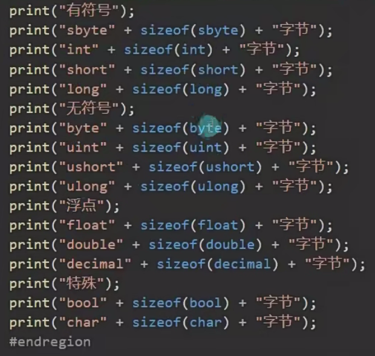

| 变量类型 | 字节数 | 变量类型 | 字节数 | 变量类型 | 字节数 | 变量类型 | 字节数 |
| --- | --- | --- | --- | --- | --- | --- | --- |
| sbyte | 1 | byte | 1 | float | 4 | bool | 1 |
| int | 4 | uint | 4 | double | 8 | char | 2 |
| short | 2 | ushort | 2 | decimal | 16 | string | 字节数根据有多少个字符而定 |
| long | 8 | ulong | 8 |  |  |  |  |

以int为例，int有4个byte（字节），一个字节是8bit（位），所以int有32bit（位）。
由于1bit（位）不是0就是1，所以一个int是由32个0或1的组成的

0000 0000 0000 0000 0000 0000 0000 0000

#### 知识点三 2进制文件读写的本质

它就是通过将各类型变量转换为字节数组
将字节数组直接存储到文件中
一般人是看不懂存储的数据的
不仅可以节约存储空间，提升效率
还可以提升安全性
而且在网络通信中我们直接传输的数据也是字节数据（2进制数据）

#### 知识点四 各类型数据和字节数据相互转换

C#提供了一个公共类帮助我们进行转化
我们只需要记住API即可

**类名：** BitConverter

**命名空间：** `using System`

##### 将各类型转字节

int占4个字节 所以字节数组长度为4

[0]代表前8位 99表示的是十进制

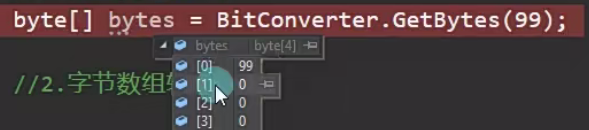

[1]代表第9到16位 8位二进制数代表的最大十进制数是255

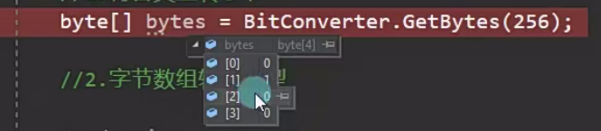

##### 字节数组转各类型

第一个参数是传字节数组，第二个参数是传开始索引（从这个字节数组的哪一位[index]开始转）

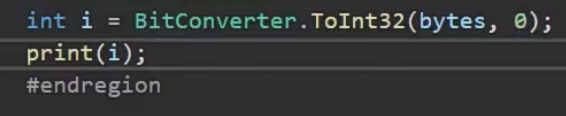

有几个类型是不支持这么转的，如decimal和string
decimal类型几乎不用，所以不必在意
string类型接下来会专门将它的转化方法

#### 知识点五 标准编码格式
##### 科普

编码是用预先规定的方法将文字、数字或其他对象编成数码，或将信息、数据转换成规定的电脉冲信号。
为了保证编码的正确性，编码要规范化、标准化，即需有标准的编码格式。
常见的编码格式有ASCII、ASCI、GBK、GB2312、UTF-8、GB18030和UNICODE等

##### 解释

> **说人话：** 计算机中的数据本身就是 2 进制数据。编码格式就是用对应的二进制数对应不同的文字。由于世界上有各种不同的语言，所以会有很多种不同的编码格式；不同的编码格式对应的规则也不同。如果在读取字符时采用了不统一的编码格式，可能会出现乱码。

游戏开发中常见的编码格式是 UTF-8，中文相关编码格式 GBK，英文相关编码格式 ASCII。在 C# 中有个专门的编码格式类来帮助我们将字符串和字节数组进行转换。

**类名：** Encoding

**需要引用命名空间：** using System.Text;

##### 将字符串以指定编码格式转字节

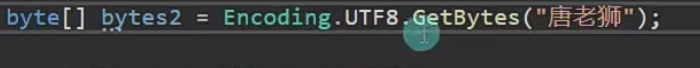

```csharp
byte[] bytes2 = Encoding.UTF8.GetBytes("你好");
```

##### 字节数组以指定编码格式转字符串

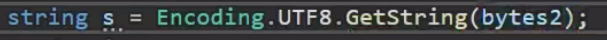

```csharp
string s = Encoding.UTF8.GetString(bytes2);
```

#### 总结

我们可以通过BitConverter和Encoding类
将所有C#提供给我们的数据类型和字节数组之间进行相互转换了
我们需要熟练掌握其中的API

### 文件操作相关

#### 文件相关
##### 代码中的文件操作是做什么

在电脑上我们可以在操作系统中创建删除修改文件
可以增删改查各种各样的文件类型
代码中的文件操作就是通过代码来做这些事情

> **说人话：**通过代码增删改查文件

##### 文件相关操作公共类

C#提供了一个名为File（文件）的公共类
让我们可以快捷的通过代码操作 文件相关

**类名：** File

**命名空间：** `System.IO`

##### 文件操作File类的常用内容
###### 1.判断文件是否存在 File.Exists(”文件路径”)

```csharp
File.Exists(”文件路径”);
//返回值是bool类型
```

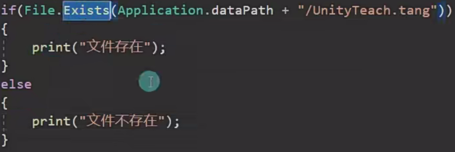

###### 2.创建文件 File.Create("文件路径")

```csharp
File.Create("文件路径");
//返回值是FileStream类型
```

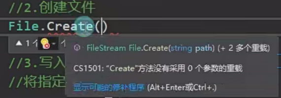

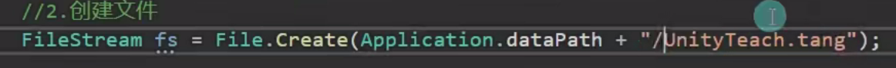

创建后刷新一下Project窗口可以看到工程路径下出现UnityTeach

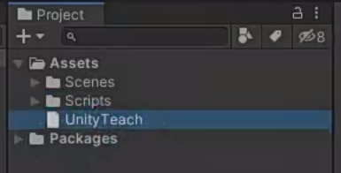

后缀即为刚才创建时的后缀

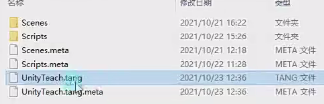

###### 3.写入文件

1.将指定字节数组写入到指定路径的文件夹中

```csharp
File.WriteAllBytes("路径",字节数组);
//如果该路径没有该文件，就会自动创建一个文件
```

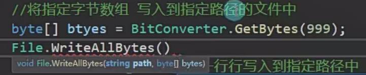

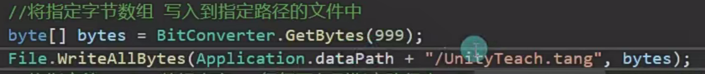

2.将指定的string数组内容一行行写入到指定路径中

```csharp
File.WriteAllLines("文件路径",字符串数组);
```

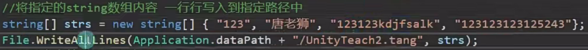

运行后用Sublime Test打开，显示内容如下：

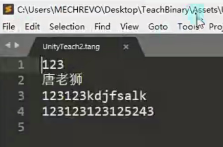

3.将指定字符串写入指定程序

```csharp
File.WriteAllText("文件路径",字符串数组);
```

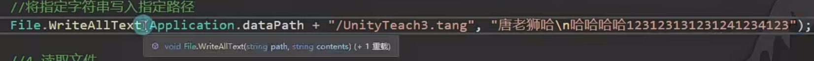

运行后用Sublime Test打开，显示内容如下：

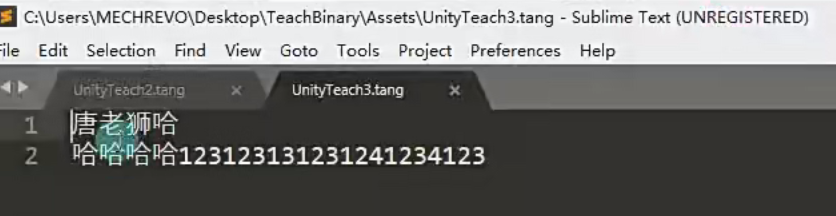

###### 4.读取文件

读取字节文件

```csharp
File.ReadAllBytes("路径");
```

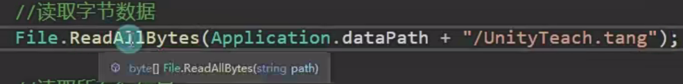

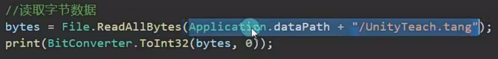


读取所有行信息

```csharp
File.ReadAllLines("路径");
```

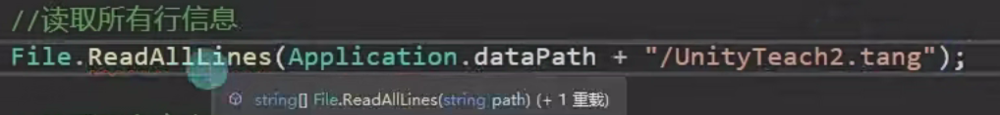

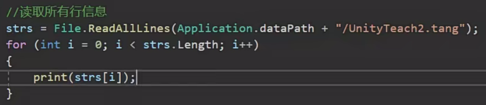

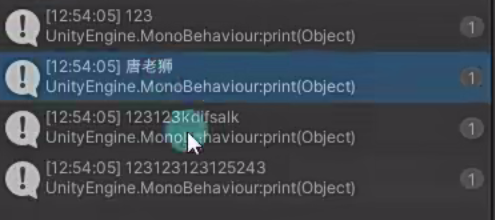

读取所有文本信息

```csharp
File.ReadAllText("路径");
```

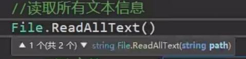

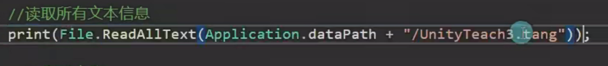


###### 5.删除文件

注意 如果删除打开着的文件 会报错

```csharp
File.Delete("路径");
```

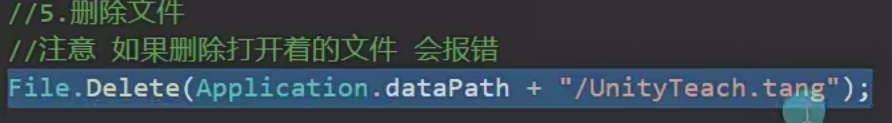

###### 6.复制文件

**参数一：** 现有文件 需要是流关闭状态

**参数二：** 目标文件

```csharp
File.Copy("路径1","路径2");
```

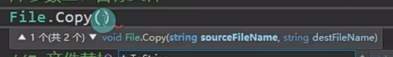

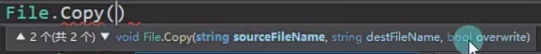

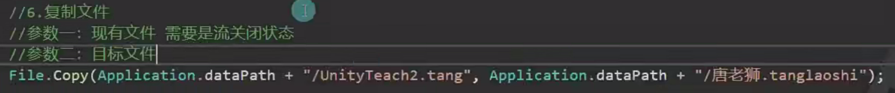

###### 7.文件替换

**参数一：** 用来替换的路径

**参数二：** 被替换的路径

**参数三：** 备份路径

```csharp
File.Replace()
```

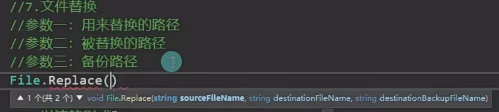

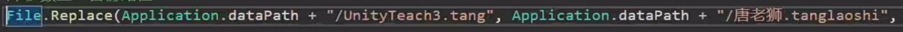

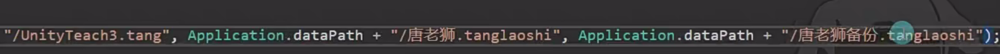

###### 以流的形式 打开文件并写入或读取

**参数一：** 路径

**参数二：** 打开模式

**参数三：** 访问模式

```csharp
File.Open()
```

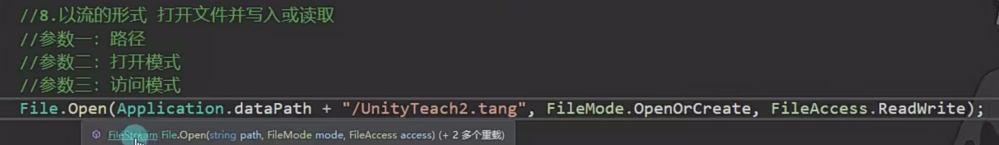

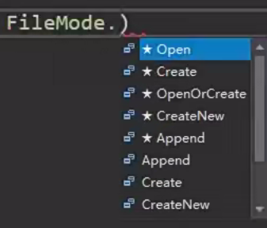

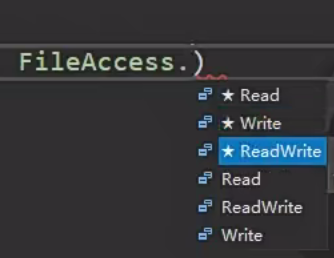

#### 文件流相关
##### 什么是文件流

在C#中提供了一个文件流类 FileStream类
它主要作用是用于读写文件的细节
我们之前学过的File只能整体读写文件
而FileStream可以以读写字节的形式处理文件

> **说人话：**

文件里面存储的数据就像是一条数据流（数组或者列表）
我们可以通过FileStream一部分一部分的读写数据流
比如我可以先存一个int（4个字节）再存一个bool（1个字节）再存一个string（n个字节）
利用FileStream可以以流式逐个读写

##### FileStream文件流类常用方法

**类名：** FileStream

**需要引用命名空间：** System.IO

###### 1.打开或创建指定文件

方法一：new FileStream

**参数一：** 路径

###### 参数二：打开模式

CreateNew：创建新文件 如果文件存在 则报错
Create：创建文件，如果文件存在，则覆盖
Open：打开文件，如果文件不存在，报错
OpenOrCreate：打开或者创建文件 根据实际情况操作
Append：若存在文件，则打开并查找文件尾，或者创建一个新文件
Truncate：打开并清空文件内容

**参数三：** 访问模式

**参数四：** 共享权限

None：谢绝共享
Read：允许别的程序读取当前文件
Write：允许别的程序写入该文件
ReadWrite：允许别的程序读写该文件

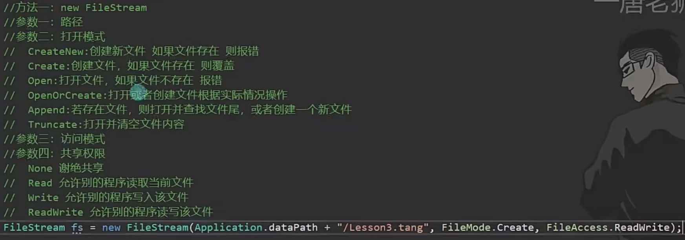

方法二：File.Create

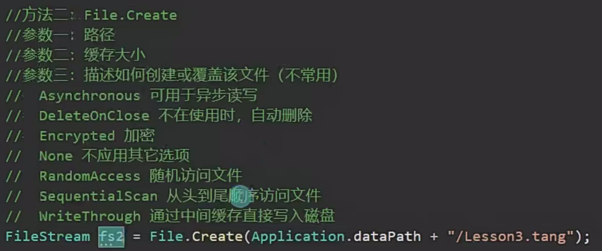

方法三：File.Open

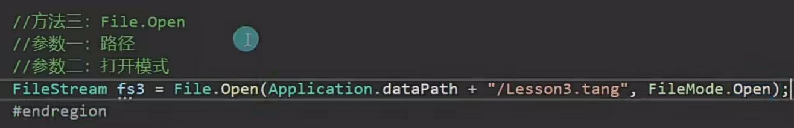

###### 2.重要属性或方法

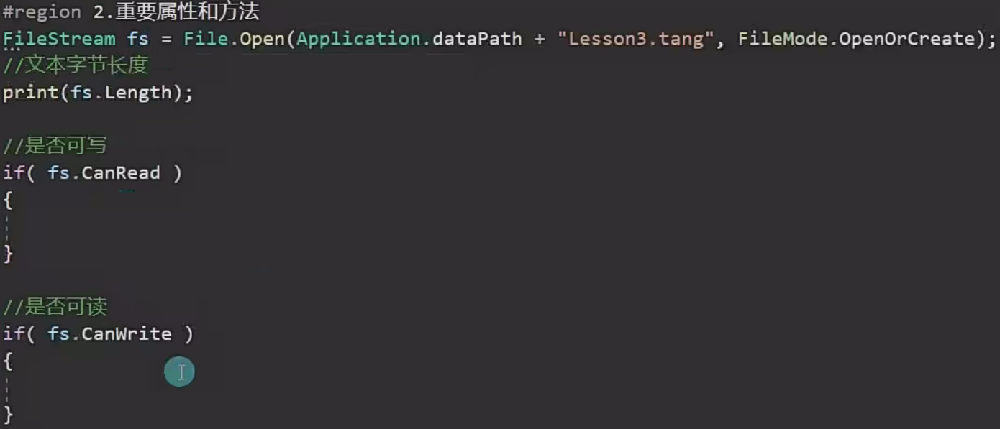

通过文件流写的文件其实是存在内存里，内存里有一部分是缓存空间，如果文件写了之后，没有执行这个方法，最后保存过后有可能会造成一些数据的丢失。文件里面的字节还没有真正地写入文件里面，所以每次通过流形式写入文件过后，一定要执行一次这个Flush( )才能保证把字节真正写入文件当中

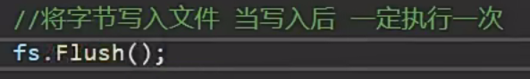

文件流就像是一条河 读写完后要把闸关了，不然它会一直处于打开的状态

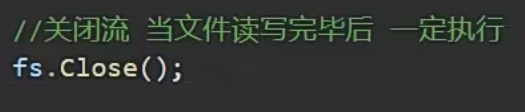

清空缓存

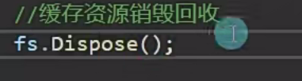

###### 3.写入字节

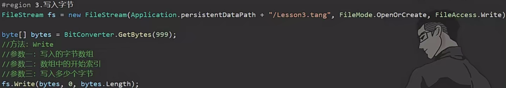

参数三最好还是直接写数字，有利于记忆各种类型的数据占多少字节

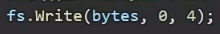

写入字符串时
先写入长度
再写入字符串具体的内容

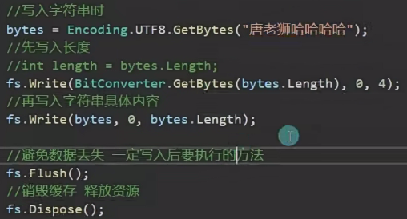

打开文件夹查看写入结果

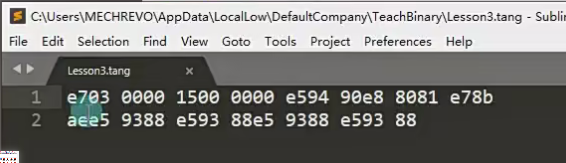

###### 4.读取字节
###### 方法一：挨个读取字节数组

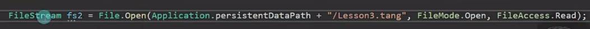

申明一个数组长度为4的空字节数组

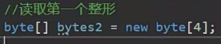

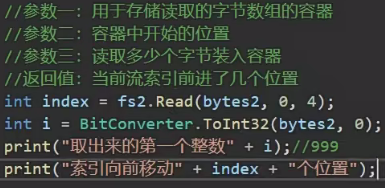

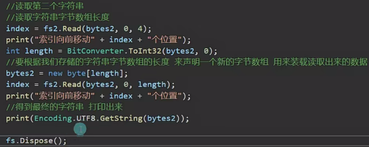


每次执行Read时都会有一个看不到的索引值往前移动，每次读取时都往后移一次
关于流索引值

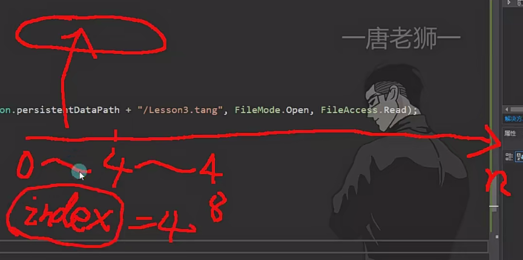


###### 方法二：一次性读取再挨个读取

一开始就用一个很长的容器去读取全部内容
然后再在这个容器内部去解析它


打印结果如下：


##### 更加安全的使用文件流对象

强调：以后都这么写


**用法：** 


**理解：** 当这个语句块结束过后，会自动调用引用对象的Dispose( )的方法

##### 总结


#### 文件夹相关
##### 文件夹操作是指什么

平时我们可以在操作系统的文件管理系统中通过一些操作增删查改文件夹
我们目前要学的就是通过代码的形式来对文件夹进行增删查改的操作

##### C#提供给我们的文件夹操作公共类

**类名：** Directory

**命名空间：** `using System.IO`

1.判断文件夹是否存在

```csharp
using System.IO;
if(Directory.Exits(Application.datapath + "/数据持久化四"))
{
    print("存在文件夹");
}       
```

2.创建文件夹

```csharp
DirectoryInfo info = Directory.CreateDirectory(Application.dataPath + "/数据持久化四")
```

3.删除文件夹

```csharp
//参数一：路径
//参数二：是否删除非空目录，如果为true，将删除整个目录，如果是false，仅当改该目录为空时删除
不填参数二 若删除非空目录会报错，一般来说，不填更安全
Directory.Delete(Application.dataPath + "/数据持久化四");
```

4.查找文件夹和文件

得到指定路径下的所有文件夹名

```csharp
string[] strs = Directory.GetDirectories(Application.dataPath);
for(int i = 0; i<strs.Length; i++)
{
    print(strs[i]);
}
```


只打印了子目录文件夹名，没打印文件名
得到指定路径下所有文件名

```csharp
strs = Directory.GetFiles(Application.datapath);
for(int i = 0; i<strs.Length; i++)
{
    print(strs[i]);
}
```


5.移动文件夹

```csharp
//参数一：要移动的文件夹的路径
//参数二：移动到的新文件夹的路径
//移动会把文件夹中所有的内容一起移到新的路径
//如果第二个参数所在的路径 已经存在了一个文件夹 那么会报错
Directory.Move(Application.dataPath + "/数据持久化四"，Application.datapath + "/123123");
```

上述是一些主要的方法，更多方法可以点击类名按F12进去细看

##### DirectoryInfo和FileInfo

DirectoryInfo目录信息类
我们可以通过它获取文件夹的更多信息
它主要出现在两个地方

1.创建文件夹方法的返回值


2.查照上级文件夹信息


重要方法
得到所有子文件夹的目录信息


FileInfo文件信息类


##### 总结


#### 练习题


### C#类对象的序列化和反序列化

#### 什么是序列化和反序列化

序列化：把对象转化为可传输的字节序列过程称为序列化
反序列化：把字节序列还原为对象的过程称为反序列化
> **说人话：**
序列化就是把想要储存的内容转换为字节序列用于存储或传递
反序列化就是把存储或收到的字节序列信息解析读取出来使用

#### 序列化
##### 序列化对象第一步——申明类对象

注意：如果要使用C#自带的序列化二进制方法，申明类时需要添加[System.Serialization]特性


##### 序列化对象第二步——将对象进行二进制序列化

方法一：使用内存流得到二进制字节数组
主要用于得到字节数组 可以用于网络传输
新知识点

1.内存流对象

**类名：** MemoryStream

**命名空间：** `System.IO`

2.二进制格式化对象

**类名：** BinaryFormatter

**命名空间：** `System.Runtime.Serialzation.Formatters.Binary`

**主要方法：** 序列化方法 Serialize


方法二：使用文件流进行存储
主要用于存储到文件中


两种方法都要掌握

#### 反序列化
##### 反序列化之反序列化文件中数据

主要类
FileStream文件流类
BinaryFormatter 二进制格式化类
主要方法
Deserialize


##### 反序列化之反序列化网络传输过来的二进制数据

主要类
MemoryStream内存流类
BinaryFormatter二进制格式化类
主要方法
Deserialize


#### 加密
##### 何时加密？何时解密？


##### 加密是否100%安全


##### 常用加密算法


##### 用简单的异或加密感受加密的作用

异或：同一个位 不同为1，相同为0


#### 练习题


先写成单例


存储和读取方法


申明一个静态变量表示数据存储的位置


存储数据的具体方法


读取数据的具体方法


### 总结

#### 学习内容回顾


#### 优缺点


#### 主要用处


## 实践项目

### 知识补充

#### Unity中添加菜单栏功能
##### 一 、为编辑器菜单栏添加新的选项入口

可以通过Unity提供我们的MenuItem特性在菜单栏添加选项按钮

**特性名：** MenuItem

**命名空间：** `UnityEditor`

MuenItem要添加在静态方法前

**规则一：** 一定是静态方法

**规则二：** 我们这个菜单按钮 必须至少有一个子层（至少有一个斜杠）不然会报错 它不支持只有一个菜单栏入口

**规则三：** 这个特性可以用在任意的类当中（不管是否继承Mono）


```csharp
using UnityEditor;
public class TTet
{
    //原理是利用了反射的形式，不必深究
    [MenuItem("GameTool/Test/生成Excel信息")]
    private static void Test()
    {
        Debug.Log("hello");
    }
}
```


点击按钮就会执行这个函数里面的逻辑

##### 二、刷新Project窗口内容

每次在Asset文件夹下新建都要在project窗口手动刷新才会显示

**类名：** AssetDatabase

**命名空间：** `UnityEditor`

**方法：** `Refresh`

```csharp
using UnityEditor;
using System.IO;
public class TTet
{
    [MenuItem("GameTool/Test/生成Excel信息")]
    private static void Test()
    {
        Debug.Log("hello");
        //创建文件夹
        Directory.CreateDirectory(Application.datapath + "/测试文件夹");
        //自动刷新
        AssetDatabase.Refresh();
    }
}
```

这些方法和特性都是Unity写好的，提供给开发者的，这里面的原理不必深究

##### 三、Editor文件夹

Edotir文件夹可以放在项目的任何文件夹下，可以有多个
放在其中的内容，项目打包时不会被打包到项目中
一般编辑器相关代码都可以放在该文件夹中
总结
我们在学习通过Excel表生成数据的功能时
可以在菜单栏加一个按钮
点击后就可以自动为我们生成对应数据了

#### Excel数据读取
##### 导入Excel相关Dll包

一、了解Excel表的本质


二、导入官方提供的Excel相关DLL文件
用的是2018的，不知道会不会太老


##### Excel数据读取

### 需求分析

### Excel配置表数据功能

### 表加载使用功能

### 导出通用工具包

> 本节内容待补充。
