## 1. 光照概述

### 什么是光照模型

光照模型（Lighting Model）是指用于模拟光照效果的一组数学公式和算法，用来确定 3D 场景中模型表面应该如何反射和散射光线，从而实现视觉上逼真的照明效果。

说人话就是：光照模型是计算光照效果的数学公式，是业界前辈们探索出来的一套计算规则。

### 物体的颜色从哪来

在现实生活中，一个物体的颜色由射进眼睛里的光线决定。当光线照射到物体表面时：

- 一部分光被物体表面吸收
- 一部分光被物体表面反射
- 对于透明物体，还有一部分光会穿过物体，形成透射光

只有反射光和透射光才能进入眼睛，从而产生视觉效果，也就是物体呈现出的亮度和颜色。因此，物体表面的光照颜色由入射光、物体材质，以及材质与光的交互规律共同决定。

### 本章内容概览

1. **漫反射光照模型**：光线被粗糙表面无规则地向各个方向反射，是各个方向平均反射光线的模型，适用于墙壁、纸张、布料等物体的表现效果。
2. **高光反射光照模型**：考虑视角和光源方向，使物体表面出现高光点，适用于金属、陶瓷、塑料等物体的表现效果。
3. **Unity 内置光照函数**：基于前述模型提供便捷的内置光照接口。

## 2. 逐顶点光照与逐片元光照

### 逐顶点光照

| 项目 | 说明 |
| --- | --- |
| 计算位置 | 顶点着色器回调函数中 |
| 计算方式 | 在每个物体的顶点上进行光照计算，顶点之间的内部区域使用插值获得颜色信息 |
| 优点 | 计算量较小，通常在移动设备上性能较好 |
| 缺点 | 照明效果可能不够精细，颜色插值不足以捕捉细微的照明变化 |
| 适用场景 | 移动游戏等需要在有限资源下获得较好性能的场景 |

### 逐片元光照

| 项目 | 说明 |
| --- | --- |
| 计算位置 | 片元着色器回调函数中 |
| 计算方式 | 对每个像素（片元）独立计算光照，每个像素根据位置、法线、材质等信息独立计算 |
| 优点 | 精细度高，可以捕捉物体表面上的细微照明变化，提供更逼真的效果 |
| 缺点 | 计算量较大，像素密集的场景需要更多计算资源 |
| 适用场景 | PC / 主机游戏等需要高质量照明效果和较高视觉逼真度的场景 |

### 对比总结

| 维度 | 逐顶点光照 | 逐片元光照 |
| --- | --- | --- |
| 计算阶段 | 顶点着色器 | 片元着色器 |
| 计算粒度 | 仅顶点计算，中间像素插值 | 屏幕每一个像素独立计算 |
| 画面精度 | 低，高光、明暗过渡容易出现锯齿 | 高，细节、高光过渡平滑真实 |
| 性能开销 | 小，适合移动端低配设备 | 大，对 GPU 算力要求更高 |
| 典型使用场景 | 手游、轻量化小游戏 | PC / 主机 3A、写实高精度渲染项目 |

> 提示：Unity 标准 PBR 管线默认使用**逐片元光照**；早期移动端简化管线会采用逐顶点光照做性能优化。

### 插值运算由谁完成

我们不需要自己处理插值运算，插值由图形硬件（GPU）执行。GPU 负责 3D 图形的渲染，包括顶点插值和像素插值等操作；这个过程在图形硬件中被高度优化，因此在实时渲染中能够快速高效地执行，我们只需要了解插值运算的大概规则即可。

假设一个三角面片的三个顶点为 A、B、C，面片中的任意像素 P 首先会计算出它相对于 3 个顶点的位置权重，再使用这些权重参与 P 点的颜色计算：

$$
PixelColor_P = Weight_A \times Color_A + Weight_B \times Color_B + Weight_C \times Color_C
$$

仅顶点处计算光照时，中间像素完全依靠插值混合。若模型顶点稀疏，高光、明暗渐变会出现块状断层，这也是逐片元光照需要逐像素计算来规避的问题。

## 3. 兰伯特光照模型：基础概念

### 两个颜色相乘

两个颜色变量相乘常用于计算光照、材质混合、纹理混合等需求，是一种混合颜色的操作，结果可以理解为两种颜色叠加在一起的效果。颜色相乘使用各颜色通道的值进行逐通道乘法。

举例：颜色 A、B 都是 `fixed4` 类型变量：

$$
A \times B = (A.r \times B.r,\ A.g \times B.g,\ A.b \times B.b,\ A.a \times B.a)
$$

总结：两个颜色变量相乘，得到的结果表示两个颜色叠加在一起。

1. **运算规则**：颜色相乘为**逐通道乘法**，RGBA 四个通道各自独立相乘，互不干扰。
2. **取值范围特性**：Shader 中颜色通道值域为 `[0, 1]`，两数相乘结果只会更小或相等，视觉上表现为**变暗、滤色**。典型场景是光照颜色 × 物体固有色，模拟光线被材质吸收后的反射效果。
3. **典型应用场景**：
   - 光照计算：光源颜色 × 物体纹理颜色
   - 蒙版混合：主纹理 × 遮罩贴图
   - 环境色叠加：环境光 × 物体底色

### 漫反射与兰伯特模型

漫反射（Diffuse Reflection）是光线撞击物体表面后向各个方向均匀反射的过程。在漫反射下，光线以无规律的方式散射，而不是像镜面反射那样按照特定角度反射，因此物体表面看起来均匀而不闪烁。

兰伯特光照模型（Lambert Lighting Model），也叫朗伯反射模型，由瑞士数学家约翰·海因里希·朗伯（Johann Heinrich Lambert）于 1760 年左右首次提出。朗伯是 18 世纪杰出的科学家，在光学和数学领域作出了众多贡献。兰伯特模型描述了漫反射表面对光线的反射行为，成为计算机图形学和渲染领域重要的基础模型之一。

原理：兰伯特光照模型认为，漫反射光的强度仅与入射光方向和反射点处表面法线夹角的余弦成正比。

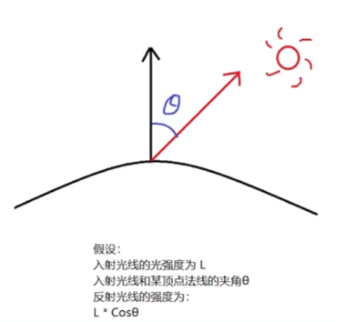

### 兰伯特光照公式

$$
C_{diffuse} = C_{light} \times C_{material} \times \max(0, \hat{N} \cdot \hat{L})
$$

其中：

1. 归一化后的物体表面法线向量 `N` 与归一化后的光源方向向量 `L` 点乘，结果就是 `cosθ`；
2. `max(0, cosθ)` 用来避免负数：模型背面认为照不到光，直接乘以 0 变成黑色。

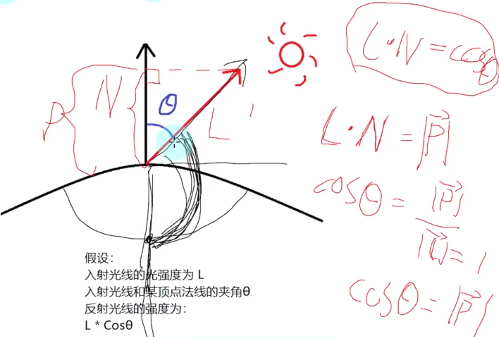

### 在 Shader 中获取公式关键信息

| 公式元素 | Shader 中的获取方式 |
| --- | --- |
| 光源颜色 | `Lighting.cginc` 内置文件中的 `_LightColor0` |
| 光源方向 | `_WorldSpaceLightPos0`，表示光源 0 在世界坐标系下的位置 |
| 向量归一化 | `normalize` |
| 取最大值 | `max` |
| 点乘 | `dot` |
| 环境光 | `UNITY_LIGHTMODEL_AMBIENT.rgb`，用于模拟环境光，避免物体阴影部分完全黑暗 |
| 模型空间法线转世界空间 | `UnityObjectToWorldNormal` |

## 4. 兰伯特光照模型：逐顶点实现

### 实现步骤

1. 声明材质漫反射颜色属性
2. 设置渲染标签 `Tags`，将光照模式设置为向前渲染（通常用于不透明物体的基本渲染）
3. 引用内置文件 `UnityCG.cginc` 和 `Lighting.cginc`
4. 声明结构体
5. 基于公式实现逻辑

### Shader 代码

```hlsl
Shader "Unlit/Lambert"
{
    Properties
    {
        _MainColor("Main Color", Color) = (1,1,1,1)
    }
    SubShader
    {
        Tags { "LightMode"="ForwardBase" }
        Pass
        {
            CGPROGRAM
            #pragma vertex vert
            #pragma fragment frag
            #include "UnityCG.cginc"
            #include "Lighting.cginc"

            // 材质的漫反射颜色
            fixed4 _MainColor;

            // 顶点着色器传递给片元着色器的内容
            struct v2f
            {
                // 裁剪空间下的顶点坐标信息
                float4 pos : SV_POSITION;
                // 对应顶点的漫反射颜色
                float3 color : COLOR;
            };

            // 逐顶点光照：漫反射颜色计算在顶点着色器中完成
            v2f vert (appdata_base v)
            {
                v2f v2fData;
                // 将顶点坐标从模型空间转换到裁剪空间
                v2fData.pos = UnityObjectToClipPos(v.vertex);

                // 将法线从模型空间转换到世界空间
                float3 normal = UnityObjectToWorldNormal(v.normal);
                // 光源方向
                float3 lightDir = normalize(_WorldSpaceLightPos0.xyz);
                // 漫反射光照颜色 = 材质颜色 * 光源颜色 * max(0, 法线 · 光源方向)
                float3 diffuse = _MainColor.rgb * _LightColor0.rgb * max(0, dot(normal, lightDir));
                // 环境光 + 漫反射光
                v2fData.color = UNITY_LIGHTMODEL_AMBIENT.rgb + diffuse;
                return v2fData;
            }

            fixed4 frag (v2f i) : SV_Target
            {
                return fixed4(i.color, 1);
            }
            ENDCG
        }
    }
}
```

## 5. 兰伯特光照模型：逐片元实现

实现步骤与逐顶点光照一致，区别在于光照计算从顶点着色器移到了片元着色器中，对每个像素独立完成。

```hlsl
Shader "Unlit/LambertF"
{
    Properties
    {
        _MainColor("Main Color", Color) = (1,1,1,1)
    }
    SubShader
    {
        Tags { "LightMode"="ForwardBase" }
        Pass
        {
            CGPROGRAM
            #pragma vertex vert
            #pragma fragment frag
            #include "UnityCG.cginc"
            #include "Lighting.cginc"

            // 材质的漫反射颜色
            fixed4 _MainColor;

            // 顶点着色器传递给片元着色器的内容
            struct v2f
            {
                // 裁剪空间下的顶点坐标信息
                float4 pos : SV_POSITION;
                // 世界空间下的法线
                float3 normal : NORMAL;
            };

            v2f vert (appdata_base v)
            {
                v2f v2fData;
                // 将顶点坐标从模型空间转换到裁剪空间
                v2fData.pos = UnityObjectToClipPos(v.vertex);
                // 将法线从模型空间转换到世界空间
                v2fData.normal = UnityObjectToWorldNormal(v.normal);
                return v2fData;
            }

            fixed4 frag (v2f i) : SV_Target
            {
                // 光源方向
                float3 lightDir = normalize(_WorldSpaceLightPos0.xyz);
                // 世界空间下的法线，插值后重新归一化
                float3 worldNormal = normalize(i.normal);
                // 漫反射光照颜色 = 光源颜色 * 材质颜色 * max(0, 法线 · 光源方向)
                fixed3 color = _LightColor0.rgb * _MainColor.rgb * max(0, dot(worldNormal, lightDir));
                // 环境光 + 漫反射光
                color = UNITY_LIGHTMODEL_AMBIENT.rgb + color;
                return fixed4(color, 1);
            }
            ENDCG
        }
    }
}
```

## 6. 半兰伯特光照模型：基础概念

### 单位向量点乘的结果范围

单位向量 A 和单位向量 B 的点乘结果为：

$$
A \cdot B = |A| \times |B| \times \cos\theta = \cos\theta
$$

`cosθ` 的范围在 -1 到 1 之间：夹角为 0° 时点乘结果为 1，夹角为 180° 时点乘结果为 -1。因此，单位向量点乘的结果范围为 [-1, 1]。

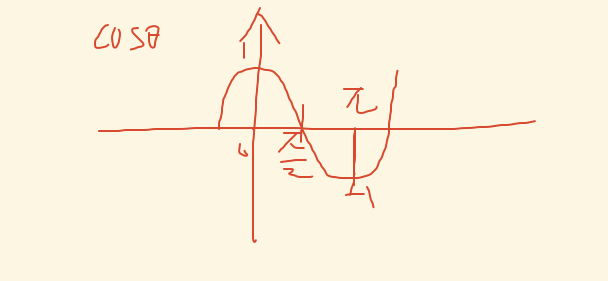

兰伯特光照公式：

$$
C_{diffuse} = C_{light} \times C_{material} \times \max(0, \hat{N} \cdot \hat{L})
$$

### 来历与原理

半兰伯特光照模型基于兰伯特光照模型改进而来。它没有任何物理依据，只是一个视觉加强技术。它出现的主要原因，是兰伯特光照模型在背光面是全黑的，而半兰伯特光照模型可以让背光面也有明暗变化。

半兰伯特光照模型没有特定的发明者，它是图形学领域众多研究人员共同贡献的结果。研究人员们经常相互借鉴和改进现有模型，以更好地模拟真实世界中的光照和材质反射。

原理：与兰伯特光照模型的理论一致，认为漫反射光的强度仅与入射光方向和反射点处表面法线夹角的余弦成正比。

### 公式与两种模型对比

半兰伯特漫反射光照颜色计算公式：

$$
C_{diffuse} = C_{light} \times C_{material} \times (\hat{N} \cdot \hat{L} \times 0.5 + 0.5)
$$

两种光照模型后半段映射规则对比：

1. **标准兰伯特（Lambert）光照模型**：后半段采用 `max(0, 归一化法线向量 · 归一化光源方向向量)`。当法线与光源方向点积结果小于 0 时，直接截断置为 0，完全舍弃背光面的光照贡献。
2. **半兰伯特（Half-Lambert）光照模型**：后半段采用 `(归一化法线向量 · 归一化光源方向向量) × 0.5 + 0.5`。对于点积小于 0 的背光区域，经线性映射后数值落在 0 到 0.5 区间，保留了微弱的背光亮度，避免物体暗部完全死黑。

二者本质都是将向量点积原始值域 [-1, 1] 线性映射至光照合法值域 [0, 1]，仅对负向点积结果的处理策略不同，最终造成暗部视觉效果差异。

## 7. 半兰伯特光照模型：逐顶点实现

```hlsl
// 半兰伯特光照模型（逐顶点）
Shader "Unlit/Half_Lambert"
{
    Properties
    {
        _MainColor ("Main Color", Color) = (1, 1, 1, 1)
    }
    SubShader
    {
        Tags { "LightMode"="ForwardBase" }

        Pass
        {
            CGPROGRAM
            #pragma vertex vert
            #pragma fragment frag

            #include "UnityCG.cginc"
            #include "Lighting.cginc"

            fixed4 _MainColor;

            struct v2f
            {
                float4 pos : SV_POSITION;
                fixed3 color : COLOR;
            };

            v2f vert (appdata_base v)
            {
                v2f o;
                o.pos = UnityObjectToClipPos(v.vertex);
                // 法线
                float3 normal = UnityObjectToWorldNormal(v.normal);
                // 光源方向
                float3 lightDir = normalize(_WorldSpaceLightPos0.xyz);
                // 漫反射光照颜色 = 材质颜色 * 光源颜色 * (0.5 * 点积 + 0.5)
                fixed3 diffuse = _MainColor.rgb * _LightColor0.rgb * (0.5 * dot(normal, lightDir) + 0.5);
                o.color = UNITY_LIGHTMODEL_AMBIENT.rgb + diffuse;
                return o;
            }

            fixed4 frag (v2f i) : SV_Target
            {
                return fixed4(i.color, 1);
            }
            ENDCG
        }
    }
}
```

## 8. 半兰伯特光照模型：逐片元实现

```hlsl
// 半兰伯特光照模型（逐片元）
Shader "Unlit/Half_LambertF"
{
    Properties
    {
        _MainColor ("MainColor", Color) = (1, 1, 1, 1)
    }
    SubShader
    {
        Tags { "LightMode"="ForwardBase" }

        Pass
        {
            CGPROGRAM
            #pragma vertex vert
            #pragma fragment frag

            #include "UnityCG.cginc"
            #include "Lighting.cginc"

            fixed4 _MainColor;

            struct v2f
            {
                float4 pos : SV_POSITION;
                float3 normal : NORMAL;
            };

            v2f vert (appdata_base v)
            {
                v2f o;
                o.pos = UnityObjectToClipPos(v.vertex);
                o.normal = UnityObjectToWorldNormal(v.normal);
                return o;
            }

            fixed4 frag (v2f i) : SV_Target
            {
                float3 lightDir = normalize(_WorldSpaceLightPos0.xyz);
                float3 worldNormal = normalize(i.normal);
                fixed3 color = _LightColor0.rgb * _MainColor.rgb * (0.5 * dot(worldNormal, lightDir) + 0.5);
                color = UNITY_LIGHTMODEL_AMBIENT.rgb + color;
                return fixed4(color, 1);
            }
            ENDCG
        }
    }
}
```

## 9. 四种材质对比

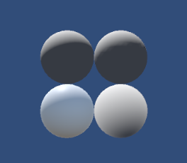

## 10. Phong 式高光反射光照模型：基础概念

### 原理

Phong 式高光反射光照模型基于光的反射行为和观察者的位置决定高光反射的表现效果。它认为高光反射的颜色与光源的反射光线以及观察者位置方向向量夹角的余弦值成正比，并且通过对余弦值取 n 次幂来表示光泽度（或反光度）。

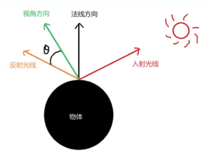

### 公式

$$
C_{specular} = C_{light} \times C_{specular\_material} \times \max(0, \hat{V} \cdot \hat{R})^n
$$

其中：

1. 归一化后观察方向向量 `V` 与归一化后的反射方向向量 `R` 点乘，得到的结果就是 `cosθ`；
2. 幂 n 代表光泽度，对余弦值取 n 次幂。

### 在 Shader 中获取关键信息

| 公式元素 | Shader 中的获取方式 |
| --- | --- |
| 观察者的位置（摄像机位置） | `_WorldSpaceCameraPos` |
| 相对于法线的反射向量 | `reflect(入射向量, 顶点法向量)`，返回反射向量 |
| 指数幂 | `pow(底数, 指数)`，返回计算结果 |

## 11. Phong 光照模型：基本概念

### 两个颜色相加

在学习兰伯特光照模型时，我们了解到两个颜色相乘的概念：通过各自的 RGBA 值相乘得到一个新颜色。两个颜色相加和相乘的区别如下：

- **颜色相乘**的效果是最终颜色会往**黑色**靠拢。计算两个颜色混合时通常使用颜色相乘，因为在现实世界中，多个颜色混合后会趋向黑色。
- **颜色相加**的效果是最终颜色会往**白色**靠拢。计算光照反射时通常使用颜色相加，因为颜色向白色靠拢会带来**更亮**的视觉效果，更符合光线的表现。

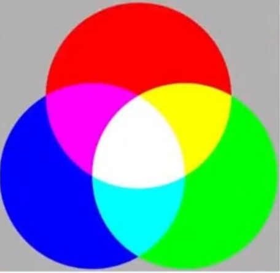


### Unity Shader 中的环境光

在学习兰伯特和半兰伯特光照模型时，我们在计算完漫反射光照后加上了一个环境光变量 `UNITY_LIGHTMODEL_AMBIENT`。这个环境光变量可以在 Unity 中设置：

`Window → Rendering → Lighting`，在 `Environment`（环境）页签的 `Environment Lighting`（环境光）中设置环境光来源。

- 当环境光来源是 **Skybox** 和 **Color** 时，可以通过 `UNITY_LIGHTMODEL_AMBIENT` 获取对应的环境光颜色。
- 当环境光来源是 **Gradient**（渐变）时，通过以下 3 个成员获取对应环境光：
  - `unity_AmbientSky`：周围的天空环境光
  - `unity_AmbientEquator`：周围的赤道环境光
  - `unity_AmbientGround`：周围的地面环境光

注意：这些内置变量都包含在 `UnityShaderVariables.cginc` 中，编译时会自动包含该文件，可以不用手动引入。

### 来历与原理

Phong 光照模型由裴祥风（Bui-Tuong Phong，越南裔美国计算机学家）于 1975 年提出，是一种局部光照经验模型。裴祥风认为物体表面反射光线由三部分组成：

环境光 + 漫反射光 + 镜面反射光（高光反射光）

### Phong 光照模型的公式

$$
C_{surface} = C_{ambient} + C_{diffuse} + C_{specular}
$$

其中：

- 环境光颜色：`UNITY_LIGHTMODEL_AMBIENT`（或 `unity_AmbientSky`、`unity_AmbientEquator`、`unity_AmbientGround`）
- 漫反射光颜色：由兰伯特光照模型计算得到
- 高光反射光颜色：由 Phong 式高光反射光照模型计算得到

## 12. Phong 光照模型：逐顶点实现

```hlsl
Shader "Unlit/Phong_V"
{
    Properties
    {
        // 材质的漫反射光照颜色
        _MainColor ("MainColor", Color) = (1,1,1,1)
        // 高光反射颜色
        _SpecularColor ("SpecularColor", Color) = (1,1,1,1)
        // 光泽度
        _SpecularNum ("SpecularNum", Range(0, 20)) = 0.5
    }
    SubShader
    {
        Pass
        {
            Tags { "LightMode"="ForwardBase" }
            CGPROGRAM
            #pragma vertex vert
            #pragma fragment frag
            #include "UnityCG.cginc"
            #include "Lighting.cginc"

            fixed4 _MainColor;
            fixed4 _SpecularColor;
            float _SpecularNum;

            struct v2f
            {
                float4 pos : SV_POSITION;
                fixed3 color : COLOR;
            };

            // 计算兰伯特光照模型颜色
            fixed3 getLambertColor(in float3 objNormal)
            {
                // 将法线从模型空间转换到世界空间（函数内部已实现归一化）
                float3 normal = UnityObjectToWorldNormal(objNormal);
                // 获取光源方向（顶点指向光源）
                float3 lightDir = normalize(_WorldSpaceLightPos0.xyz);
                // 计算漫反射光照颜色（兰伯特光照模型）
                fixed3 diffuse = _LightColor0.rgb * _MainColor.rgb * max(0, dot(normal, lightDir));
                return diffuse;
            }

            // 计算 Phong 高光反射光照模型颜色
            fixed3 getSpecularColor(in float4 objVertex, in float3 objNormal)
            {
                // 将顶点坐标从模型空间转换到世界空间
                float3 worldPos = mul(unity_ObjectToWorld, objVertex).xyz;
                // 视角方向：摄像机位置减去世界空间下的顶点坐标
                float3 viewDir = normalize(_WorldSpaceCameraPos.xyz - worldPos);
                // 将法线从模型空间转换到世界空间
                float3 normal = UnityObjectToWorldNormal(objNormal);
                // 光源方向（世界空间下的光位置方向向量）
                float3 lightDir = normalize(_WorldSpaceLightPos0.xyz);
                // reflect(入射向量, 顶点法向量) 返回反射光线向量
                float3 reflectDir = reflect(-lightDir, normal);
                // 高光反射光照颜色 = 光源颜色 * 高光反射颜色 * 反射光线向量点乘结果的 _SpecularNum 次方
                fixed3 color = _LightColor0.rgb * _SpecularColor.rgb * pow(max(0, dot(viewDir, reflectDir)), _SpecularNum);
                return color;
            }

            v2f vert (appdata_base v)
            {
                v2f o;
                // 将顶点坐标从模型空间转换到裁剪空间
                o.pos = UnityObjectToClipPos(v.vertex);
                // 计算兰伯特光照模型颜色
                fixed3 lambertColor = getLambertColor(v.normal);
                // 计算 Phong 高光反射光照模型颜色
                fixed3 specularColor = getSpecularColor(v.vertex, v.normal);
                // 最终颜色 = 环境光颜色 + 漫反射光照颜色 + 高光反射光照颜色
                o.color = UNITY_LIGHTMODEL_AMBIENT.rgb + lambertColor + specularColor;
                return o;
            }

            fixed4 frag (v2f i) : SV_Target
            {
                return fixed4(i.color, 1);
            }
            ENDCG
        }
    }
}
```

## 13. Phong 光照模型：逐片元实现

```hlsl
Shader "Unlit/Phong_F"
{
    Properties
    {
        // 材质的漫反射光照颜色
        _MainColor ("MainColor", Color) = (1,1,1,1)
        // 高光反射颜色
        _SpecularColor ("SpecularColor", Color) = (1,1,1,1)
        // 光泽度
        _SpecularNum ("SpecularNum", Range(0, 20)) = 0.5
    }
    SubShader
    {
        Pass
        {
            Tags { "LightMode"="ForwardBase" }
            CGPROGRAM
            #pragma vertex vert
            #pragma fragment frag
            #include "UnityCG.cginc"
            #include "Lighting.cginc"

            fixed4 _MainColor;
            fixed4 _SpecularColor;
            float _SpecularNum;

            struct v2f
            {
                // 裁剪空间的顶点位置
                float4 pos : SV_POSITION;
                // 世界坐标系下的顶点位置
                float3 wPos : TEXCOORD0;
                // 世界坐标系下的顶点法线
                float3 wNormal : TEXCOORD1;
            };

            // 得到兰伯特光照模型计算的颜色（逐片元）
            fixed3 getLambertColor(in float3 wNormal)
            {
                // 获取光源方向（世界空间）
                float3 lightDir = normalize(_WorldSpaceLightPos0.xyz);
                // 漫反射光照颜色 = 光源颜色 * 材质颜色 * max(0, 法线 · 光源方向)
                fixed3 diffuse = _LightColor0.rgb * _MainColor.rgb * max(0, dot(wNormal, lightDir));
                return diffuse;
            }

            // 得到 Phong 式高光反射光照模型计算的颜色（逐片元）
            fixed3 getSpecularColor(in float3 wPos, in float3 wNormal)
            {
                // 获取视角方向（世界空间）
                float3 viewDir = normalize(_WorldSpaceCameraPos.xyz - wPos);
                // 获取光源方向（世界空间）
                float3 lightDir = normalize(_WorldSpaceLightPos0.xyz);
                // 获取反射方向
                float3 reflectDir = reflect(-lightDir, wNormal);
                // 高光反射光照颜色 = 光源颜色 * 高光反射颜色 * 点乘结果的 _SpecularNum 次方
                fixed3 specular = _LightColor0.rgb * _SpecularColor.rgb * pow(max(0, dot(viewDir, reflectDir)), _SpecularNum);
                return specular;
            }

            v2f vert (appdata_base v)
            {
                v2f o;
                // 将顶点位置从模型空间转换到裁剪空间
                o.pos = UnityObjectToClipPos(v.vertex);
                // 将顶点位置从模型空间转换到世界空间
                o.wPos = mul(unity_ObjectToWorld, v.vertex).xyz;
                // 将顶点法线从模型空间转换到世界空间
                o.wNormal = UnityObjectToWorldNormal(v.normal);
                return o;
            }

            fixed4 frag (v2f i) : SV_Target
            {
                // 法线经过顶点到片元的插值后长度可能不再为 1，需要在逐片元计算前重新归一化
                float3 wNormal = normalize(i.wNormal);
                // 计算兰伯特光照模型颜色
                fixed3 lambertColor = getLambertColor(wNormal);
                // 计算 Phong 式高光反射光照模型颜色
                fixed3 specularColor = getSpecularColor(i.wPos, wNormal);
                // 最终颜色 = 环境光颜色 + 漫反射光照颜色 + Phong 式高光反射光照颜色
                fixed3 color = UNITY_LIGHTMODEL_AMBIENT.rgb + lambertColor + specularColor;
                return fixed4(color, 1);
            }
            ENDCG
        }
    }
}
```

## 14. Blinn-Phong 光照模型

### 来历

Blinn-Phong 式高光反射光照模型是对经典 Phong 光照模型的改进，主要用于计算高光反射颜色。它由吉姆·布林（Jim Blinn，美国计算机科学家）提出，改进了高光反射的计算方法。

### 原理

Blinn-Phong 光照模型使用**半角向量**来计算镜面反射，而不是像 Phong 光照模型那样使用反射向量。半角向量是视角方向和灯光方向的角平分线，这个改进使得计算更加高效，特别是在实时渲染中。

Blinn-Phong 式高光反射光照模型认为：

- 高光反射颜色与顶点法线向量和半角向量夹角的余弦值成正比
- 通过将余弦值取 n 次幂来表示光泽度（或反光度），n 值越高，表面越光滑

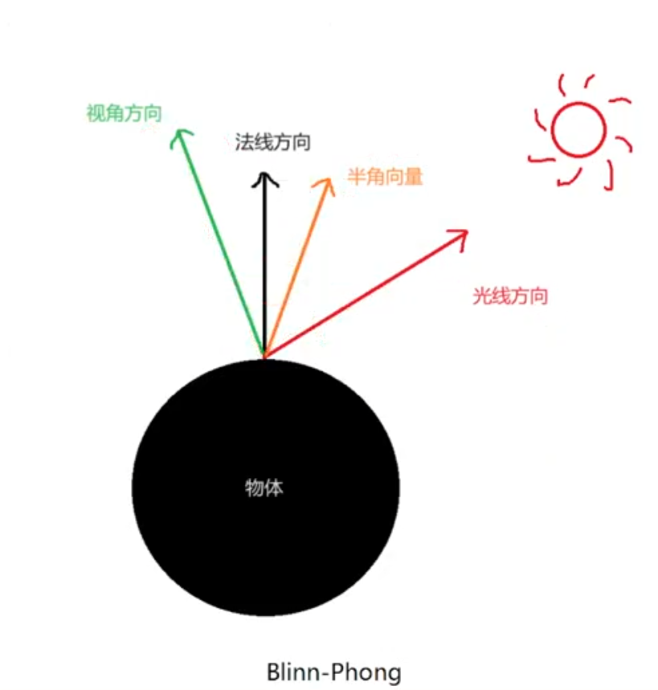

### 公式

$$
C_{specular} = C_{light} \times C_{specular\_material} \times \max(0, \hat{N} \cdot \hat{H})^n
$$

其中：

1. 标准化后的顶点法线方向向量 `N` 与标准化后的半角向量方向向量 `H` 的点乘结果为 `cosθ`，代表反射光的角度；
2. 半角向量 `H` 的计算方式为视角单位向量和入射光单位向量的和，采用平行四边形法则；
3. 幂次 n 代表光泽度，值越大表示表面越光滑，反射光越集中。

### 与 Phong 光照模型的关系

Blinn-Phong 光照模型的整体实现和 Phong 光照模型一致，只需把高光反射光照颜色的计算公式换成 Blinn-Phong 式高光反射光照模型所得颜色，即用半角向量 `H` 代替反射向量 `R` 参与点乘。

## 15. 为什么逐片元比逐顶点平滑

### 知识回顾

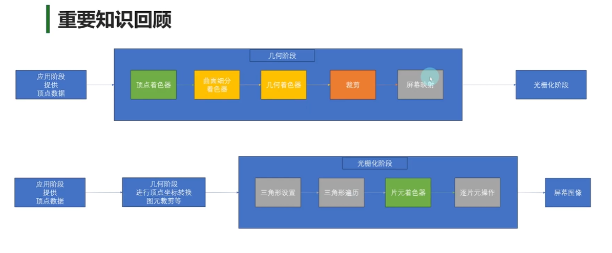

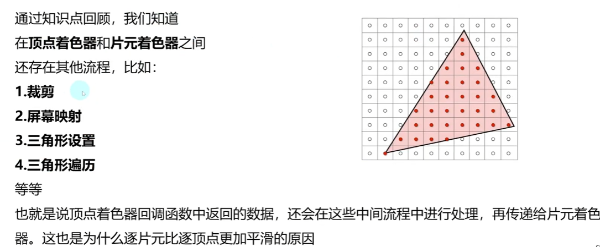

### 为什么逐顶点光照比较粗糙

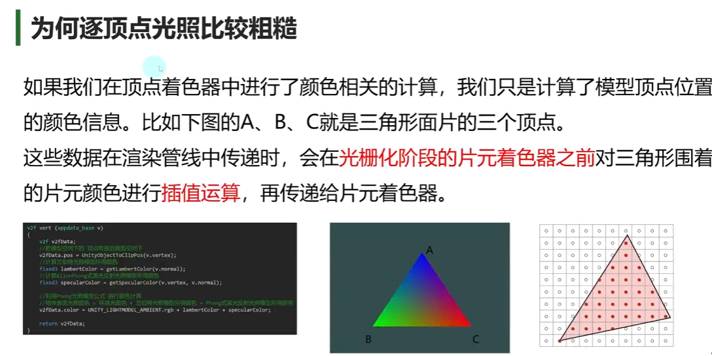

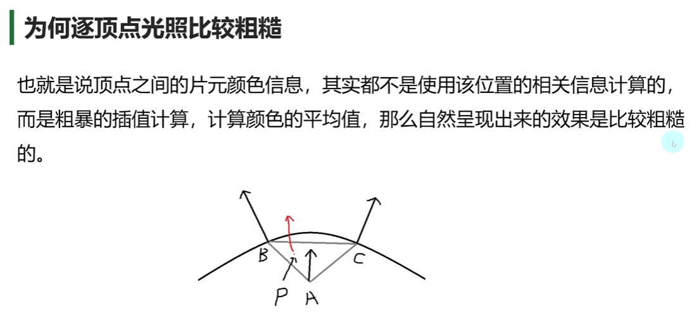

### 为什么逐片元光照更加平滑

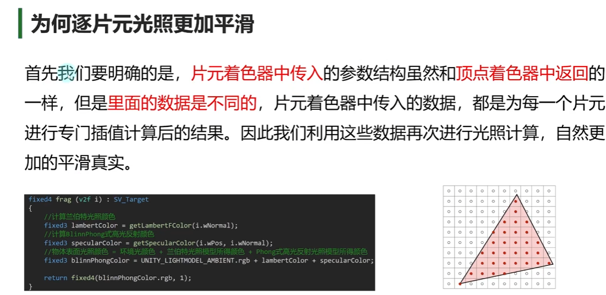

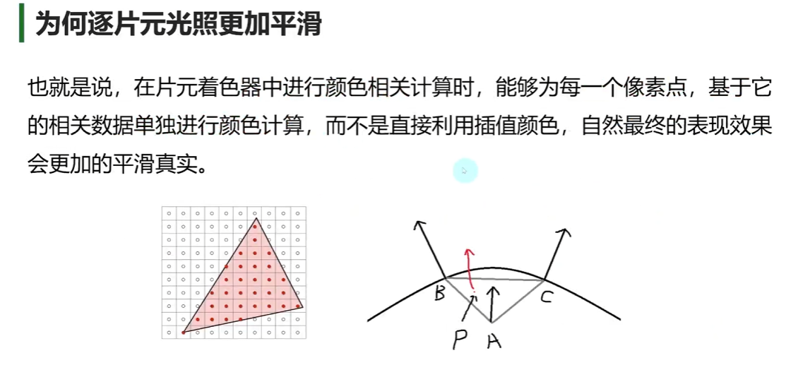

### 总结

- **逐顶点**：只在三个顶点上计算光照，三角形内部像素的颜色由这三个顶点的颜色插值得到。省性能，但高光容易丢失，大面片会一块一块的。
- **逐片元**：三个顶点只提供法线、位置等数据，内部像素先插值这些量，再对每个像素单独计算一次光照。性能开销大，但过渡更平滑，高光也更准确。


