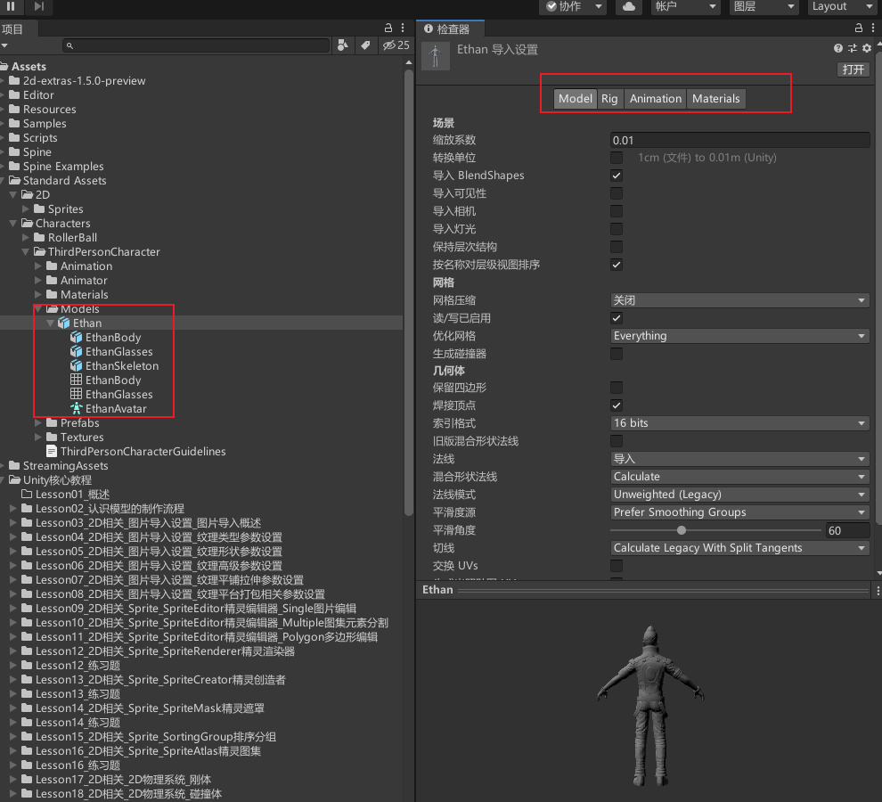
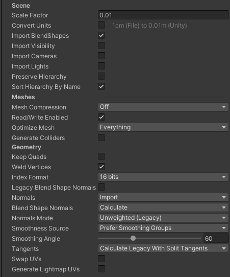
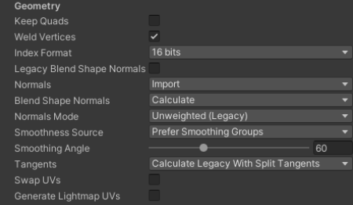
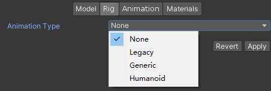
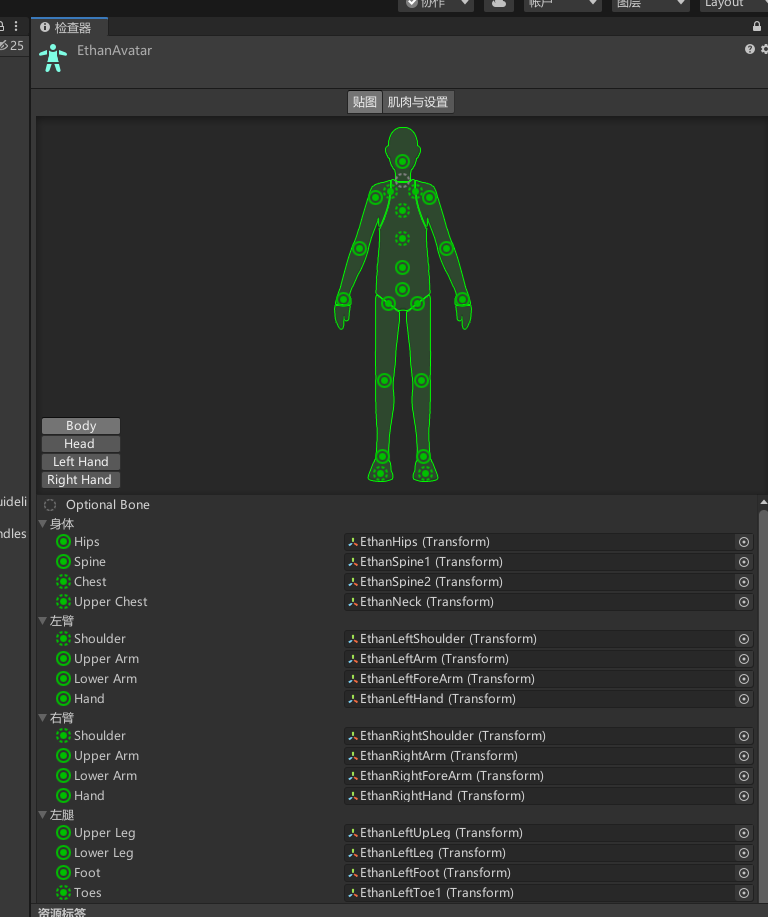
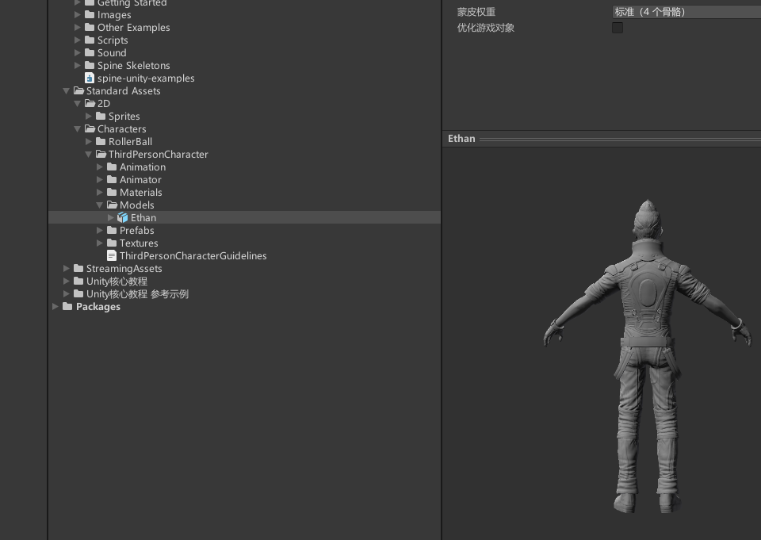
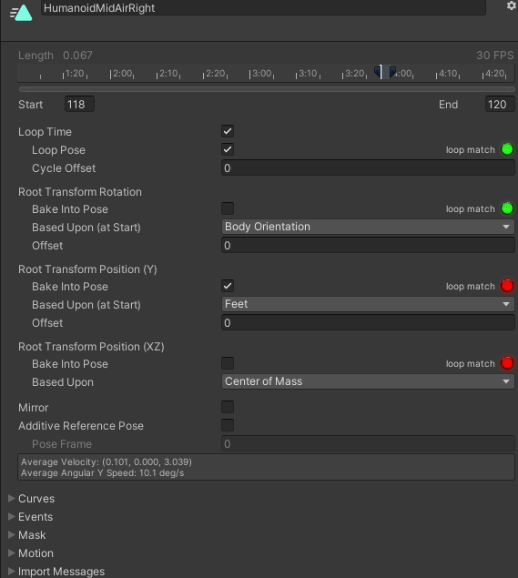
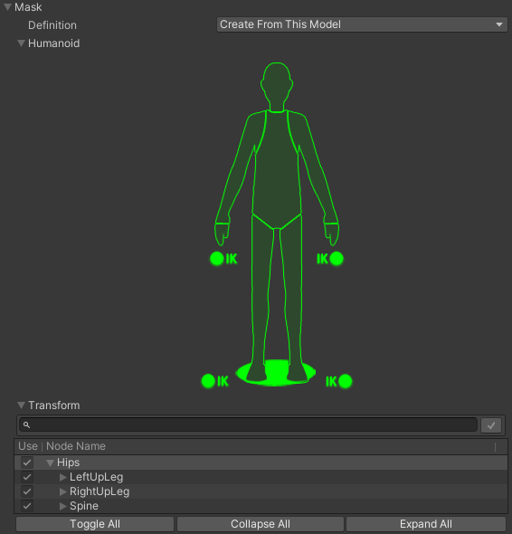
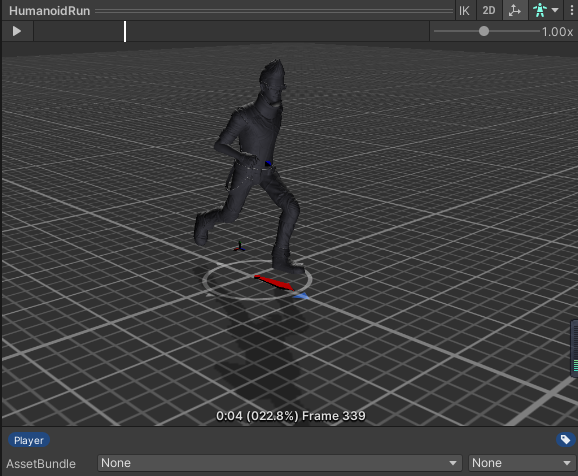
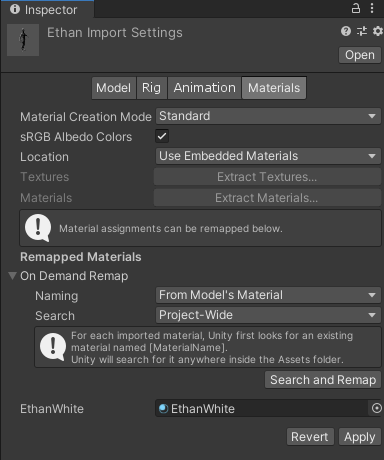

## 模型导入概览

Unity 支持多种 3D 模型格式，例如 `.fbx`、`.dae`、`.3ds`、`.dxf`、`.obj` 等。实际项目中，美术通常在 3ds Max、Maya、Blender 等 DCC 软件中制作模型，然后导出给 Unity 使用。

项目中一般优先使用 FBX：

- 减少不必要数据，提升导入效率。
- 不要求每台开发机器都安装建模软件。
- 更稳定，避免原始 DCC 文件因软件版本、插件或授权导致导入异常。

常见导入流程：

1. 美术在 DCC 软件中制作模型，按项目规范导出 FBX。
2. 程序或 TA 将 FBX 放入 Unity 项目的 `Assets` 目录。
3. 在 Inspector 中设置模型的 `Model`、`Rig`、`Animation`、`Materials` 四个页签。
4. 应用设置后，再把模型拖入场景、制成 Prefab 或接入 Animator。

导出时建议统一坐标约定：人物面朝 Unity 的 `Z+`，头顶朝 `Y+`，角色右侧朝 `X+`。比例也要统一，Unity 里通常按 `1 unit = 1 meter` 理解。

## 四个导入页签

| 页签 | 主要作用 |
| --- | --- |
| Model | 设置模型比例、层级、摄像机、灯光、网格、法线、切线、UV、碰撞器等。 |
| Rig | 设置动画类型、骨骼映射、Avatar、蒙皮权重、骨骼优化等。 |
| Animation | 设置是否导入动画、动画压缩、剪辑拆分、循环、根运动、事件、遮罩和预览。 |
| Materials | 设置材质生成方式、材质位置、贴图和材质提取、材质命名与匹配规则。 |

导入模型时，先看模型是否需要动画：静态场景模型重点关注 `Model` 和 `Materials`；角色模型还要重点检查 `Rig` 和 `Animation`。

## Model 页签

`Model` 页签控制模型的基础导入方式。它决定模型进入 Unity 后的比例、层级、网格数据、法线切线和 UV 等。

### Scene 设置

| 参数 | 作用 | 常见建议 |
| --- | --- | --- |
| Scale Factor | 缩放系数，用于调整模型全局比例。 | 尽量在 DCC 软件中统一比例；Unity 中只做必要修正。 |
| Convert Units | 将模型文件单位转换为 Unity 单位。不同格式有不同默认缩放。 | 通常保持默认，发现比例异常再检查。 |
| Import BlendShapes | 导入混合形状，用于表情、形变等。 | 有 BlendShape 需求时开启。 |
| Blend Shape Normals | 设置 BlendShape 法线来源或计算方式。 | 表情光照异常时重点检查。 |
| Import Visibility | 导入 FBX 中的可见性动画。 | 一般关闭，确实需要隐藏/显示动画时开启。 |
| Import Cameras | 导入文件中的摄像机。 | 游戏模型通常关闭。 |
| Import Lights | 导入文件中的灯光。 | 通常关闭，灯光一般在 Unity 中单独配置。 |
| Preserve Hierarchy | 保留原始层级根节点。 | 多个 FBX 共用骨架层级、动画与模型分离时很重要。 |
| Sort Hierarchy By Name | 按名称排序子节点。关闭则保留文件中的层级顺序。 | 需要严格保持骨骼顺序时关闭。 |

### Meshes 设置

| 参数 | 作用 | 常见建议 |
| --- | --- | --- |
| Mesh Compression | 网格压缩，压缩越高文件越小，但精度越低。 | 低端或大量静态模型可试 Low/Medium，重要角色谨慎压缩。 |
| Read/Write Enabled | 是否在 CPU 内存中保留可读写网格数据。 | 不需要运行时读写 Mesh 时关闭以节省内存。 |
| Optimize Mesh | 重排顶点或索引，提高 GPU 访问效率。 | 多数情况选 Everything 或默认优化。 |
| Generate Colliders | 自动生成 Mesh Collider。 | 静态环境可考虑开启；动态物体慎用。 |

`Read/Write Enabled` 只有在运行时需要访问网格数据时才建议开启，例如合并网格、修改顶点、运行时烘焙 NavMesh、某些 MeshCollider 需求等。否则会增加内存占用。

### Geometry 设置

| 参数 | 作用 | 常见建议 |
| --- | --- | --- |
| Keep Quads | 保留四边形，不强制转三角面。 | 曲面细分等特殊需求才开启。 |
| Weld Vertices | 合并位置相同且属性兼容的顶点。 | 通常开启，可减少顶点数量。 |
| Index Format | 网格索引格式，可选 Auto、16 bits、32 bits。 | 16 bits 更省内存；顶点数超过限制才用 32 bits。 |
| Legacy Blend Shape Normals | 使用旧版方式计算 BlendShape 法线。 | 兼容旧项目时才考虑。 |
| Normals | 法线导入方式：Import、Calculate、None。 | 美术已处理好法线时 Import；需要 Unity 计算时 Calculate。 |
| Blend Shape Normals | BlendShape 法线计算方式。 | 使用 BlendShape 且光照异常时检查。 |
| Normals Mode | 法线加权方式。 | 默认 Area And Angle Weighted 通常够用。 |
| Smoothness Source | 决定平滑边依据。 | 优先使用 DCC 中设置好的平滑组。 |
| Smoothing Angle | 计算法线时用于决定硬边/软边的角度。 | 模型应优先在 DCC 中处理平滑。 |
| Tangents | 切线导入或计算方式。 | 使用法线贴图时必须有正确切线。 |
| Swap UVs | 交换 UV 通道。 | 漫反射贴图和光照贴图 UV 异常时才用。 |
| Generate Lightmap UVs | 生成第二套光照贴图 UV。 | 静态光照烘焙模型常用。 |

法线决定明暗过渡，切线常用于法线贴图。角色或高质量模型最好让美术在 DCC 软件中处理好法线、平滑组和切线，再由 Unity 导入。

## Rig 页签

`Rig` 页签用于设置模型如何被动画系统识别，核心是动画类型、骨骼根节点和 Avatar。

### Animation Type

| 类型 | 含义 | 适用场景 |
| --- | --- | --- |
| None | 不导入动画骨骼信息。 | 石头、建筑、道具等静态模型。 |
| Humanoid | 人形动画，使用 Avatar 做人体骨骼映射和动画重定向。 | 标准人形角色。 |
| Generic | 通用动画，使用模型自身骨骼结构。 | 怪物、机械、非标准人形、任意骨骼动画。 |
| Legacy | 旧版动画系统。 | 兼容 Unity 3.x 或旧项目，一般不推荐新项目使用。 |

### Humanoid 设置

Humanoid 的重点是 Avatar。Avatar 是 Unity 对人形骨骼的标准化映射：只要两个角色都正确映射到 Unity 的人形骨骼结构，一个角色的动作理论上就可以重定向到另一个角色上。

| 参数 | 作用 |
| --- | --- |
| Avatar Definition | 决定 Avatar 来源。 |
| No Avatar | 不使用 Avatar。 |
| Create From This Model | 从当前模型创建 Avatar。 |
| Copy From Other Avatar | 使用另一个模型已有的 Avatar，常用于动画文件和网格文件分离的情况。 |
| Source | 当选择 Copy From Other Avatar 时，指定复制哪个 Avatar。 |
| Configure | 打开 Avatar 配置界面，手动检查和修正骨骼映射。 |

Avatar 配置界面常见内容：

- `Mapping`：检查身体、头、左右手等骨骼是否正确映射。
- `Pose`：重置姿势、采样绑定姿势、强制 T-Pose。
- `Muscles & Settings`：预览各肌肉组旋转，并限制每个肌肉的活动范围。
- `Done`：完成配置并返回模型导入面板。

如果模型动作变形奇怪，优先检查 Avatar 映射是否正确，尤其是肩、手、髋、膝、脚踝等关节。

### Skin Weights

| 参数 | 作用 |
| --- | --- |
| Standard (4 Bones) | 每个顶点最多受 4 根骨骼影响，常用默认值。 |
| Custom | 自定义每个顶点最大骨骼数和权重阈值。 |
| Max Bones / Vertex | 每个顶点最多受多少根骨骼影响，越高越耗性能。 |
| Max Bone Weight | 低于该阈值的骨骼权重会被忽略。 |

通常角色模型使用 `Standard (4 Bones)` 即可。只有在高质量角色或特殊绑定需求下，才考虑自定义。

### Optimize Game Objects

开启后，Unity 会把部分骨骼层级隐藏并存入 Avatar 和 Animator 的内部结构中，从而提高动画性能。

| 参数 | 作用 |
| --- | --- |
| Optimize Game Objects | 优化骨骼 GameObject 层级，提高动画性能。 |
| Extra Transforms to Expose | 指定仍然需要暴露出来的骨骼节点。 |
| Search | 按名称搜索骨骼。 |
| Toggle All | 全选或反选。 |
| Collapse All / Expand All | 折叠或展开骨骼列表。 |

如果代码、挂点、武器、特效需要访问某些骨骼，开启优化后要把这些骨骼加入 `Extra Transforms to Expose`。

### Generic 与 Legacy

Generic 用于非标准人形模型，重点是设置 `Root Node`。Root Node 决定该 Avatar 使用哪个骨骼作为根节点。

Legacy 是旧动画系统选项，一般新项目不使用。它的 `Generation` 可设置旧版动画导入方式，例如不导入动画或存储在根节点中，主要用于兼容老资源。

### Muscles & Settings

`Muscles & Settings` 用来预览和限制 Humanoid Avatar 的人体运动范围。

| 区域 | 作用 |
| --- | --- |
| Muscle Group Preview | 按身体部位预览旋转效果，检查映射是否合理。 |
| Per-Muscle Settings | 单独限制某个肌肉/关节的旋转范围。 |
| Additional Settings | 设置手脚扭转、伸展和 Translation DoF 等高级选项。 |
| Translation DoF | 是否允许人形骨骼产生平移动画。一般关闭，除非动画确实需要骨骼位置移动。 |

## Animation 页签

`Animation` 页签用于设置模型中包含的动画剪辑。角色动作 FBX 通常会在这里拆分多个 Clip，并设置循环、根运动、压缩和事件。

建议美术资源尽量拆成两类：

- 模型文件：包含网格、材质、骨骼，不包含动作。
- 动画文件：不包含网格，只包含同骨架动作。

这样可以减少重复数据，也方便多个角色或多个动作之间复用。

### 基础导入参数

| 参数 | 作用 |
| --- | --- |
| Import Constraints | 导入约束信息，Unity 会添加相应约束组件并关联对象。 |
| Import Animation | 是否从资源中导入动画。关闭后不会导入任何动画剪辑。 |
| Bake Animations | 将 IK 或模拟生成的动画烘焙成关键帧，主要用于 Maya、3ds Max、Cinema 4D 文件。 |
| Anim. Compression | 动画压缩方式。 |
| Rotation Error | 旋转曲线压缩容错。 |
| Position Error | 位置曲线压缩容错。 |
| Scale Error | 缩放曲线压缩容错。 |
| Animated Custom Properties | 导入 FBX 中指定为自定义用户属性的动画属性。 |

### Anim. Compression

| 类型 | 含义 |
| --- | --- |
| Off | 不压缩动画，质量最好但文件和内存占用更大。 |
| Keyframe Reduction | 删除冗余关键帧，常用于 Generic 动画。 |
| Keyframe Reduction and Compression | 删除冗余关键帧并压缩存储，主要用于 Legacy。 |
| Optimal | 由 Unity 选择合适压缩方式，适用于 Generic 和 Humanoid。 |

`Rotation Error`、`Position Error`、`Scale Error` 只在关键帧削减或 Optimal 压缩时有意义。容错越大，越容易删掉关键帧，体积更小但动画越可能失真。

### 动画剪辑列表

动画剪辑列表用于查看、添加、删除和选择模型中的 Clip。选中某个 Clip 后，可以在下方编辑它的名称、帧范围和详细属性。

### 动画剪辑属性

| 参数 | 作用 |
| --- | --- |
| Clip Name | 动画剪辑名称。修改后需要 Apply，上方剪辑列表会同步更新。 |
| Start / End | 当前剪辑的起始帧和结束帧。用于从长动画中拆出多个动作。 |
| Loop Time | 是否循环播放。适合 Idle、Walk、Run 等循环动作。 |
| Loop Pose | 尝试让首尾姿势无缝衔接。 |
| Cycle Offset | 循环周期偏移，让循环动画从周期中的某个位置开始。 |
| Mirror | 左右镜像动作，仅 Humanoid 显示。 |
| Additive Reference Pose | 启用叠加动画的参考姿势帧。 |
| Pose Frame | 参考姿势使用的具体帧。 |

### Root Transform 设置

Root Transform 决定动画中的根运动如何处理。它直接影响角色是“动画带着角色移动”，还是“动画只在原地播放，移动交给代码”。

| 区域 | 参数 | 作用 |
| --- | --- | --- |
| Root Transform Rotation | Bake Into Pose | 将根旋转烘焙进姿势。开启后根对象不再被该旋转驱动。 |
| Root Transform Rotation | Based Upon | 根旋转依据，可选 Original、Root Node Rotation、Body Orientation 等。 |
| Root Transform Rotation | Offset | 根旋转偏移，单位为度。 |
| Root Transform Position (Y) | Bake Into Pose | 将垂直根运动烘焙进姿势。开启后根对象不会随动画上下移动。 |
| Root Transform Position (Y) | Based Upon | 垂直位置依据，可选 Original、Root Node Position、Center Of Mass、Feet 等。 |
| Root Transform Position (Y) | Offset | 垂直位置偏移。 |
| Root Transform Position (XZ) | Bake Into Pose | 将水平根运动烘焙进姿势。开启后根对象不会被动画水平位移带走。 |
| Root Transform Position (XZ) | Based Upon | 水平位置依据，可选 Original、Root Node Position、Center Of Mass 等。 |

一般经验：

- 角色移动由代码或 CharacterController 控制时，常把位移烘焙进 Pose，避免动画和代码抢位置。
- 需要 Root Motion 的角色，保留根运动，并在 Animator 组件中开启 `Apply Root Motion`。
- 跳跃、下落、爬台阶等动作要特别检查 Y 方向根运动。

### Curves、Events、Mask、Motion

| 折叠项 | 作用 |
| --- | --- |
| Curves | 给动画剪辑添加曲线参数。曲线 X 轴是标准化时间 `0 ~ 1`，Y 轴是自定义值，可被 Animator 参数读取。 |
| Events | 添加动画事件。播放到指定时间点时调用对象脚本中的同名函数。 |
| Mask | 动画遮罩。指定当前 Clip 影响哪些身体部位或 Transform。 |
| Motion | 当动画包含根运动时，可指定特定骨骼作为根运动节点。 |
| Import Messages | 显示导入警告。必要时开启 `Generate Retargeting Quality Report` 查看重定向问题。 |

动画事件适合做时间点触发，例如攻击判定、脚步音效、特效生成。不建议把复杂逻辑都塞到动画事件里。

### 动画预览窗口

预览窗口用于检查导入动画是否正确。常见控件：

| 控件 | 作用 |
| --- | --- |
| Clip 下拉 | 切换当前预览的动画剪辑。 |
| IK | 开启脚部 IK 预览。 |
| 2D | 使用 2D 模式预览。 |
| 辅助图标 | 显示轴心、质心等辅助信息。 |
| Preview Object | 切换预览使用的对象。 |
| Play / Timeline | 播放、暂停或拖动时间轴预览。 |
| Speed | 调整预览播放速度。 |
| Time / Percent / Frame | 显示当前播放到的秒数、百分比或帧编号。 |
| Tag / AssetBundle | 设置资源标签或 AssetBundle 信息。 |

## Materials 页签

`Materials` 页签用于处理模型导入后的材质和贴图。这里决定 Unity 是使用嵌入材质、生成新材质，还是匹配项目里已有材质。

| 参数 | 作用 |
| --- | --- |
| Material Creation Mode | 定义 Unity 如何生成或导入材质。 |
| sRGB Albedo Colors | 是否在伽马空间中使用反照率颜色。线性颜色空间项目需谨慎。 |
| Location | 决定材质和纹理保留在模型内部，还是提取为外部资源。 |
| Extract Textures | 提取模型中嵌入的纹理。 |
| Extract Materials | 提取模型中嵌入的材质。 |
| Naming | 定义材质命名规则。 |
| Search | 定义 Unity 查找已有材质的位置范围。 |
| Remapped Materials | 材质重映射。Unity 找到匹配材质会自动关联，也可以手动指定。 |

### Material Creation Mode

| 模式 | 含义 |
| --- | --- |
| None | 不使用模型嵌入材质，改用 Unity 默认材质。 |
| Standard | 使用 Unity 默认规则生成材质。 |
| Import via MaterialDescription | 使用 FBX 中的材质描述生成材质，通常更准确，支持更多材质类型。 |

### Location

| 模式 | 含义 |
| --- | --- |
| Use Embedded Materials | 材质保留为模型资源内部的子资源。 |
| Use External Materials (Legacy) | 将材质提取为外部资源，偏旧版流程。 |

如果项目需要统一管理材质，通常会提取材质和贴图，再放到项目约定目录中维护。

### Naming 与 Search

| 参数 | 选项 | 含义 |
| --- | --- | --- |
| Naming | By Base Texture Name | 使用基础贴图名称命名材质；没有贴图时使用导入材质名。 |
| Naming | From Model's Material | 使用模型文件中的材质名。 |
| Naming | Model Name + Model's Material | 模型名加材质名，避免重名。 |
| Search | Local Materials Folder | 在模型所在目录的 `Materials` 子文件夹中查找。 |
| Search | Recursive-Up | 从当前目录向上递归查找所有 `Materials` 子文件夹。 |
| Search | Project-Wide | 在整个项目中查找。 |

## 常用导入建议

静态场景模型：

- `Rig` 选 `None`。
- 不需要运行时修改 Mesh 时关闭 `Read/Write Enabled`。
- 根据烘焙需求开启 `Generate Lightmap UVs`。
- 材质尽量提取出来，统一放入项目材质目录。

普通角色模型：

- `Rig` 根据角色类型选择 `Humanoid` 或 `Generic`。
- Humanoid 要检查 Avatar Mapping。
- 角色移动由代码控制时，谨慎使用 Root Motion。
- 动画压缩优先用 `Optimal` 或 `Keyframe Reduction`，但要预览确认动作没有明显失真。

动作 FBX：

- 尽量和模型文件使用同一套骨架。
- Humanoid 动作可使用 `Copy From Other Avatar` 复用 Avatar。
- 在 Animation 页签拆分 Clip，命名清晰，如 `Idle`、`Run`、`Attack_01`。
- 循环动作检查 `Loop Time` 和 `Loop Pose`。

## 易错点

- 模型比例不对：先检查 DCC 导出单位，再看 `Scale Factor` 和 `Convert Units`。
- 动画播放变形：先检查 `Rig` 类型、Avatar 映射、骨骼层级是否一致。
- 动作文件不能套到角色上：Humanoid 检查 Avatar；Generic 检查骨架结构和 Root Node。
- 动画切换后角色漂移：检查 Root Transform 和 Animator 的 `Apply Root Motion`。
- 模型运行时内存偏高：检查 `Read/Write Enabled` 是否无意义开启。
- 法线贴图效果异常：检查 `Normals`、`Tangents`、平滑组和模型 UV。
- 材质丢失或错配：检查 Materials 页签的 `Naming`、`Search` 和 Remapped Materials。
