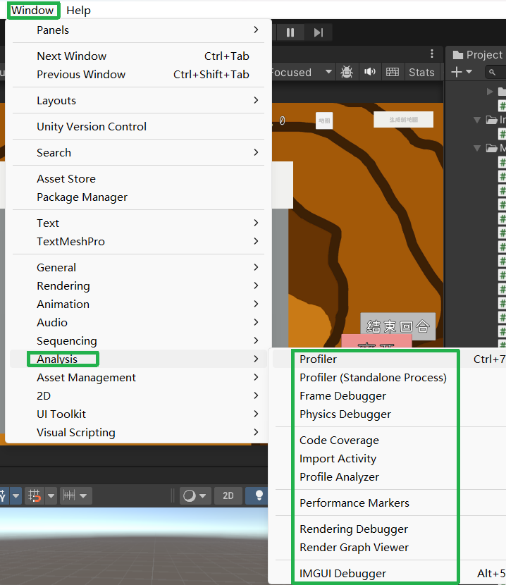

## 性能分析工具

性能分析工具主要指的是 Unity 提供给我们的，自带的很多分析性问题的工具。
它们主要集中在 Unity 工具栏的 **Window** 页签的 **Analysis** 选项中。

- **Profiler**：分析器；实时查看 CPU、GPU、内存、UI、音频等模块的性能
- **Profiler (Standalone Process)**：独立运行的分析器；独立运行的 Profiler 进程，避免自身性能干扰
- **Memory Profiler**：内存分析器；抓取内存快照，分析内存使用、泄漏、CG等
- **Frame Debugger**：帧调试器；分析一帧的Draw Call、材质切换、渲染指令
- **Physics Debugger**：物理调试器；检查物理组状态、触发器、重叠问题
