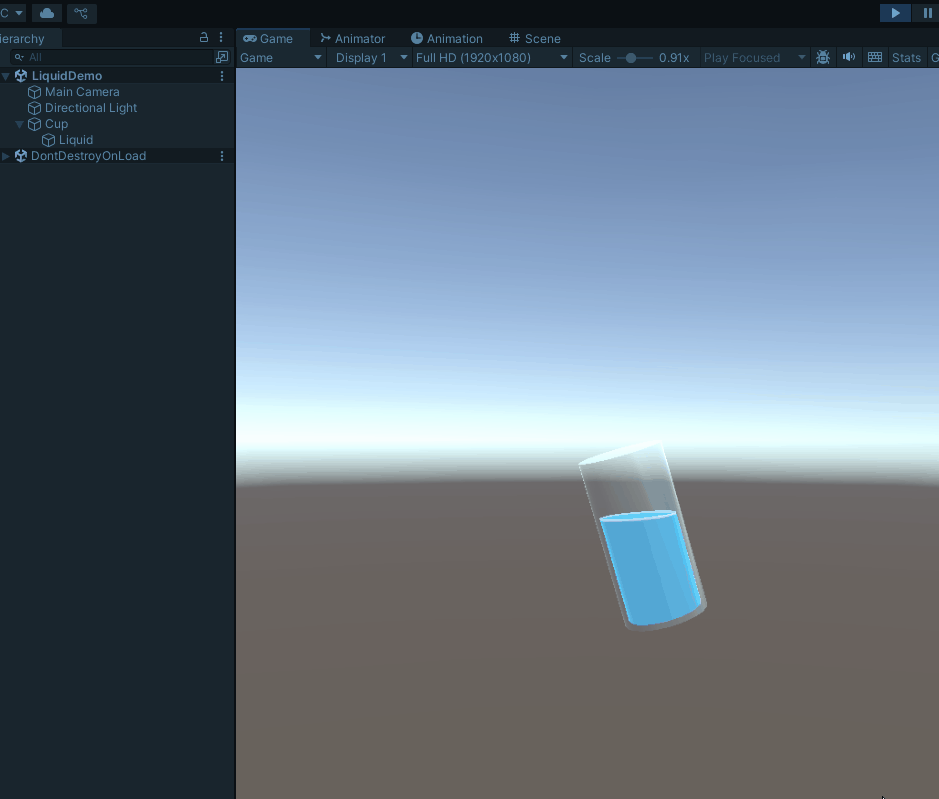

杯子被拿起、移动或倾斜时，里面的液体会慢半拍地跟上，然后来回摆动，最后逐渐平静下来。这个细节在药水瓶、饮料杯、实验器皿和道具展示中很常见。它看起来像流体模拟，但实现它并不需要求解流体方程。

本文使用一个封闭网格表示液体体积，通过 Shader 切掉液面以上的像素，再用 C# 计算容器的运动速度，驱动液面的倾斜和回弹。整个效果运行在 Unity 2022.3 和 URP 14 中，不依赖 Shader Graph 或第三方插件。

## 最终效果由什么组成

场景中实际上只有两个模型：

```text
Cup
└── Liquid
```

`Cup` 是外层容器，使用透明玻璃材质。`Liquid` 是稍微缩小的封闭网格，放在杯子内部。液体模型仍然是一个完整的 Cylinder，只是 Shader 将液面以上的片元丢弃了。

这套方案处理了以下视觉信息：

- 液体填充高度
- 世界空间中的水平液面
- 容器运动造成的液面倾斜
- 停止运动后的往复回弹
- 靠近液面的泡沫线
- 液体顶部颜色
- 液体侧面的 Fresnel 边缘光
- 运动时出现的小幅正弦波纹

它不处理倒水、飞溅、液滴分裂和真实体积守恒。这些功能需要额外的网格、粒子系统或流体模拟。

## 为什么不用真正的流体模拟

真正的实时流体模拟需要跟踪速度场、压力和边界条件。对于一个只需要装在杯子里的道具液体，这个成本通常没有必要。

本文的做法更接近一个视觉骗局：

1. 用世界空间高度判断某个像素位于液面之上还是之下。
2. 丢弃液面以上的像素。
3. 用一张倾斜的数学平面代替真实液面。
4. 根据容器的运动改变这张平面的倾斜角。
5. 用正弦函数和衰减模拟惯性。

只要液体没有离开容器，观察者通常不会关心里面是否存在真正的流体粒子。他们看到液面会保持水平、移动时会滞后，就足以接受这个效果。

## 开始前的准备

本文的实现环境是：

- Unity `2022.3.62f3c1`
- Universal Render Pipeline `14.0.12`
- 手写 HLSL Shader

如果项目使用 Built-in Render Pipeline，本文中的 URP include 和坐标转换函数不能直接使用。如果项目使用 HDRP，也需要换成 HDRP 对应的 Shader Library 和 Pass 配置。

演示阶段不需要先去 Blender 建模。Unity 自带的两个 Cylinder 就够了：

1. 创建一个 Cylinder，命名为 `Cup`。
2. 再创建一个 Cylinder，命名为 `Liquid`。
3. 将 `Liquid` 设为 `Cup` 的子对象。
4. 将 `Liquid` 的本地坐标和旋转归零。
5. 将 `Liquid` 缩放为 `(0.88, 0.95, 0.88)` 左右。
6. 禁用 `Liquid` 的 Collider。

正式模型中，杯子和液体也应该是两个对象。液体网格必须封闭，形状尽量简单，并贴合容器内腔。杯把、杯沿和玻璃厚度属于外层模型，不要把这些结构合并进液体网格。

## 核心问题：如何让液面保持水平

如果直接使用模型空间 Y 坐标裁切，液面会随着杯子一起旋转。杯子倾斜 30 度，液面也会倾斜 30 度，看起来像一块固定在杯子里的果冻。

液体静止时受重力影响，它的表面应该垂直于世界空间的 Y 轴。因此，裁切判断必须在世界空间中完成。

顶点阶段先取得世界坐标：

```hlsl
VertexPositionInputs positionInputs = GetVertexPositionInputs(input.positionOS.xyz);
output.positionCS = positionInputs.positionCS;
output.positionWS = positionInputs.positionWS;
```

片元阶段计算当前世界坐标相对液面基准点的位置：

```hlsl
float3 relativePosition = input.positionWS - _FillPosition.xyz;
```

没有晃动时，只需要判断 `relativePosition.y`：

```hlsl
clip(-relativePosition.y);
```

`clip(x)` 会在 `x < 0` 时丢弃当前片元。这里传入负的 Y 值，意味着液面上方被裁掉，液面下方保留。

因为 `relativePosition.y` 来自世界空间，容器自身的旋转不会改变液面的朝向。

## 液位不是一个浮点数，而是一个世界坐标

材质面板中的 `Fill Amount` 很适合让人调整，它的范围可以保持在 0 到 1。但 Shader 最终需要的不是这个百分比，而是世界空间中的液面位置。

C# 可以通过网格 Bounds 将两者转换：

```csharp
Bounds bounds = meshFilter.sharedMesh.bounds;
Vector3 centerWS = transform.TransformPoint(bounds.center);

float worldHeight = bounds.size.y * Mathf.Abs(transform.lossyScale.y);
float heightOffset = Mathf.Lerp(
    -worldHeight * 0.5f,
     worldHeight * 0.5f,
     fillAmount
);

Vector3 fillPosition = centerWS + Vector3.up * heightOffset;
```

`bounds.center` 是网格几何中心。先用 `TransformPoint` 将它转换到世界空间，再根据液体网格的世界高度计算上下偏移。

这个做法不依赖 Pivot 是否正好位于模型中心。对普通杯子和瓶子来说，比直接使用 `transform.position` 更稳妥。

需要注意，Bounds 高度与真实体积不是一回事。锥形瓶的 `Fill Amount = 0.5` 代表高度的一半，不代表体积的一半。如果项目需要准确的容量显示，可以为特定容器预计算一条“高度到体积”的曲线。

## 在液面方程中加入倾斜

一张水平液面可以写成：

```text
y = 0
```

给它增加 X 和 Z 方向的斜率后，可以写成：

```text
y + x * wobbleX + z * wobbleZ = 0
```

对应到 Shader：

```hlsl
float surfaceDistance = relativePosition.y
                      + relativePosition.x * _WobbleX
                      + relativePosition.z * _WobbleZ;

clip(-surfaceDistance);
```

`_WobbleX` 和 `_WobbleZ` 不是直接的角度，而是液面在两个方向上的斜率。值越大，液面越倾斜。

这里使用相对坐标很重要。如果直接拿绝对世界坐标 X、Z 乘以斜率，杯子移动到远离世界原点的位置后，液位会产生不合理的偏移。

## 用正弦波打破笔直的裁切边缘

只有平面倾斜时，液面边缘仍然是一条过于规整的直线。可以加入一段幅度很小的正弦波：

```hlsl
float movement = saturate(abs(_WobbleX) + abs(_WobbleZ));

float wave = sin(
    (relativePosition.x + relativePosition.z) * _WaveFrequency
    + _Time.y * 2.0
) * _WaveAmplitude * movement;

float surfaceDistance = relativePosition.y
                      + relativePosition.x * _WobbleX
                      + relativePosition.z * _WobbleZ
                      + wave;
```

波纹幅度乘上 `movement` 后，容器静止时液面会恢复平整。容器开始晃动，细小波纹才会出现。

当前波纹沿 X 和 Z 的和传播，计算便宜，也足以打破直线感。如果需要更自然的表面，可以叠加两组不同方向、频率和速度的正弦波。波纹幅度仍然要小，否则裁切边缘很容易穿出杯壁。

## 泡沫线来自液面距离

`surfaceDistance` 不只可以决定是否裁切，也能告诉我们片元离液面有多远。

```hlsl
float foam = 1.0 - smoothstep(
    0.0,
    _FoamWidth,
    -surfaceDistance
);

half4 sideColor = lerp(_BaseColor, _FoamColor, foam);
```

靠近液面时，`foam` 接近 1，颜色过渡到 `_FoamColor`。距离液面超过 `_FoamWidth` 后，它接近 0，显示普通液体颜色。

这里用 `smoothstep` 而不是 `step`，边缘会有一段可控的平滑过渡。`_FoamWidth` 一般保持在 `0.01` 到 `0.06` 之间。数值还会受到模型实际尺寸影响，因此更换模型后需要重新调节。

## 用背面制造液体顶部的错觉

裁切只会删除像素，不会凭空生成一个新的水平面。也就是说，切开 Cylinder 后，理论上液体顶部应该是空的。

这个效果利用网格背面补上视觉缺口。Pass 关闭背面剔除：

```hlsl
Cull Off
```

片元函数读取当前三角形朝向：

```hlsl
half4 Frag(
    Varyings input,
    bool isFrontFace : SV_IsFrontFace
) : SV_Target
```

最后分别给正面和背面着色：

```hlsl
half4 finalColor = isFrontFace
    ? sideColor
    : lerp(_TopColor, _FoamColor, foam * 0.65);
```

从斜上方观察一个封闭的凸网格时，裁切边缘附近的背面会形成类似顶部截面的区域。它不是一张真实生成的圆面，但在杯子这类简单形状中很有效。

复杂凹形网格可能暴露这个技巧。正式项目最好为液体准备简化的凸网格，而不是直接复制外层杯子的复杂拓扑。

## 给液体侧面添加边缘光

透明液体如果只有一个纯色，形体通常不够清楚。Fresnel 可以让视线接近切线方向的位置更亮：

```hlsl
half3 viewDirection = GetWorldSpaceNormalizeViewDir(input.positionWS);
half3 normalDirection = normalize(input.normalWS);

half rim = pow(
    1.0h - saturate(dot(normalDirection, viewDirection)),
    _RimPower
);

sideColor.rgb += _RimColor.rgb * rim * _RimColor.a;
```

法线朝向相机时，点积接近 1，边缘光很弱。法线与视线接近垂直时，点积接近 0，边缘光变强。

`_RimPower` 控制高光集中程度。值较低时整个侧面都会变亮，值较高时只有轮廓附近出现高光。

## URP Pass 的基本结构

Shader 需要明确声明自己属于 URP：

```hlsl
SubShader
{
    Tags
    {
        "RenderType" = "Transparent"
        "Queue" = "Transparent-10"
        "RenderPipeline" = "UniversalPipeline"
    }

    Pass
    {
        Name "LiquidForward"
        Tags { "LightMode" = "UniversalForward" }

        Cull Off
        ZWrite On
        Blend SrcAlpha OneMinusSrcAlpha

        HLSLPROGRAM
        #pragma target 3.0
        #pragma vertex Vert
        #pragma fragment Frag
        #pragma multi_compile_fog

        #include "Packages/com.unity.render-pipelines.universal/ShaderLibrary/Core.hlsl"

        // 顶点和片元代码

        ENDHLSL
    }
}
```

本文让液体写入深度，同时进行 Alpha 混合。这有利于液体自身的前后关系，但透明物体之间的排序仍然可能受相机和模型结构影响。

示例中液体材质使用 Render Queue `2990`，玻璃材质使用 `3000`，让液体通常先绘制，玻璃随后覆盖。这个顺序适合当前简单场景，不是所有透明模型的通用答案。

材质属性建议放入 `UnityPerMaterial` 常量缓冲区：

```hlsl
CBUFFER_START(UnityPerMaterial)
    half4 _BaseColor;
    half4 _TopColor;
    half4 _FoamColor;
    half4 _RimColor;
    float4 _FillPosition;
    float _FoamWidth;
    float _RimPower;
    float _WaveFrequency;
    float _WaveAmplitude;
    float _WobbleX;
    float _WobbleZ;
CBUFFER_END
```

这样写符合 URP 对材质常量缓冲区的布局要求。需要单独说明的是，部分 Unity 和 URP 版本会让使用 `MaterialPropertyBlock` 的 Renderer 退出 SRP Batcher，转入普通批处理路径。本文仍然选择 `MaterialPropertyBlock`，因为液位与晃动参数本来就是逐实例数据，避免复制材质比强行维持 SRP Batcher 更重要。大量实例同时出现时，应在目标平台上用 Frame Debugger 和 Profiler 实测。

## C# 如何感知杯子的运动

Shader 不知道杯子上一帧在哪里。C# 脚本需要记录上一帧的位置和旋转，再计算差值。

线速度很直接：

```csharp
Vector3 velocity =
    (transform.position - previousPosition) / deltaTime;
```

旋转不能直接用欧拉角相减，因为欧拉角在 0 度和 360 度之间存在跳变，而且旋转顺序也会带来问题。更合适的方法是计算四元数差：

```csharp
Quaternion delta = to * Quaternion.Inverse(from);
delta.ToAngleAxis(out float angleDegrees, out Vector3 axis);

if (angleDegrees > 180f)
    angleDegrees -= 360f;

Vector3 angularVelocity =
    axis.normalized * (angleDegrees * Mathf.Deg2Rad / deltaTime);
```

角速度的单位是弧度每秒。得到它以后，可以将水平移动和绕 X、Z 轴的旋转映射到液面倾斜：

```csharp
wobbleImpulseX +=
    (-velocity.x + angularVelocity.z * 0.18f)
    * motionSensitivity;

wobbleImpulseZ +=
    (-velocity.z - angularVelocity.x * 0.18f)
    * motionSensitivity;
```

速度前面的负号让液面产生与容器运动方向相反的惯性。容器突然向右移动，液体会先向左压低。

最后限制振幅，避免液面穿出杯子：

```csharp
wobbleImpulseX = Mathf.Clamp(
    wobbleImpulseX,
    -maxWobble,
    maxWobble
);

wobbleImpulseZ = Mathf.Clamp(
    wobbleImpulseZ,
    -maxWobble,
    maxWobble
);
```

## 用正弦函数和指数衰减模拟回弹

如果直接把速度传给 Shader，杯子停止的瞬间液面也会立刻停止，没有液体的惯性感。

脚本先保存一个晃动 impulse，再让它随时间衰减：

```csharp
float damping = Mathf.Exp(-recovery * deltaTime);
wobbleImpulseX *= damping;
wobbleImpulseZ *= damping;
```

`Mathf.Exp(-recovery * deltaTime)` 是指数衰减。相比每帧减去一个固定数值，它对帧率更稳定，也不会轻易越过零点后反向增长。

衰减后的 impulse 再乘正弦波：

```csharp
phase += deltaTime * wobbleSpeed * Mathf.PI * 2f;
float pulse = Mathf.Sin(phase);

float wobbleX = wobbleImpulseX * pulse;
float wobbleZ = wobbleImpulseZ * pulse;
```

`wobbleSpeed` 控制液体一秒内摆动多少次，`recovery` 控制振幅消失得有多快。两者是不同的概念：一个控制周期，一个控制包络线。

这不是严格的弹簧方程，但参数直观、计算稳定，很适合美术驱动的道具效果。

## 为什么要使用 MaterialPropertyBlock

`_FillPosition`、`_WobbleX` 和 `_WobbleZ` 每个实例都不同。如果直接这样设置：

```csharp
renderer.sharedMaterial.SetFloat("_WobbleX", wobbleX);
```

所有使用这份材质的液体都会读到同一个值。Play 模式中还可能修改项目里的共享材质资源。

也可以访问 `renderer.material`，但 Unity 会为每个 Renderer 克隆一份材质。容器数量增加后，会产生更多材质实例和内存开销。

`MaterialPropertyBlock` 可以在不复制材质的情况下，为单个 Renderer 覆盖少量属性：

```csharp
targetRenderer.GetPropertyBlock(properties);
properties.SetVector(FillPositionId, fillPosition);
properties.SetFloat(WobbleXId, wobbleX);
properties.SetFloat(WobbleZId, wobbleZ);
targetRenderer.SetPropertyBlock(properties);
```

属性 ID 应提前缓存，避免每帧重复处理字符串：

```csharp
private static readonly int FillPositionId =
    Shader.PropertyToID("_FillPosition");

private static readonly int WobbleXId =
    Shader.PropertyToID("_WobbleX");

private static readonly int WobbleZId =
    Shader.PropertyToID("_WobbleZ");
```

## Domain Reload 带来的空引用问题

实现过程中遇到过这样一条异常：

```text
ArgumentNullException: Value cannot be null.
Parameter name: dest
UnityEngine.Renderer.GetPropertyBlock(...)
```

问题出在 `MaterialPropertyBlock` 的生命周期。它是一个托管对象，又没有被 Unity 序列化。编辑器发生 Domain Reload 后，字段可能变回 `null`。

不要只依赖字段初始化表达式，也不要将它声明成无法重新赋值的只读字段。调用前按需创建更稳妥：

```csharp
[System.NonSerialized]
private MaterialPropertyBlock properties;

private void EnsurePropertyBlock()
{
    if (properties == null)
        properties = new MaterialPropertyBlock();
}
```

在 `OnEnable` 和真正使用它之前调用：

```csharp
private void OnEnable()
{
    CacheComponents();
    EnsurePropertyBlock();
    // 初始化上一帧状态
}
```

这类问题经常只在编辑器重编译脚本后出现。第一次进入 Play 模式正常，并不代表生命周期处理一定正确。

## 脚本的推荐结构

完整的运动脚本可以按以下职责拆分：

```text
OnEnable
  缓存 Renderer 和 MeshFilter
  创建 MaterialPropertyBlock
  初始化上一帧位置与旋转

Update
  计算 deltaTime
  计算线速度与角速度
  将运动注入 wobble impulse
  限制最大振幅
  进行指数衰减
  乘以正弦脉冲
  计算世界空间液位
  通过 MaterialPropertyBlock 写入 Shader
  保存当前帧位置与旋转

OnValidate
  在 Inspector 参数变化后刷新材质参数
```

如果希望编辑模式中也能预览液位，可以给脚本添加 `[ExecuteAlways]`。此时必须处理编辑器中的时间来源，因为未运行游戏时 `Time.deltaTime` 可能为零。

当前实现使用 `EditorApplication.timeSinceStartup` 计算编辑器时间，并将单次 delta 限制在 `0.05` 秒以内，避免编辑器卡顿或切换窗口后突然产生极大速度。

## 材质参数建议

液体材质可以从以下数值开始：

| 参数 | 建议初值 | 作用 |
| --- | ---: | --- |
| Base Color Alpha | 0.82 | 液体主体透明度 |
| Foam Width | 0.035 | 泡沫边缘宽度 |
| Rim Power | 3.0 | 边缘光集中程度 |
| Wave Frequency | 7.0 | 小波纹频率 |
| Wave Amplitude | 0.018 | 小波纹高度 |

运动脚本可以从以下数值开始：

| 参数 | 建议初值 | 作用 |
| --- | ---: | --- |
| Fill Amount | 0.62 | 液位高度 |
| Max Wobble | 0.10 | 最大液面斜率 |
| Wobble Speed | 2.2 | 来回摆动速度 |
| Recovery | 2.0 | 振幅衰减速度 |
| Motion Sensitivity | 0.035 | 对容器运动的敏感度 |

这些数值与模型尺寸有关。一个高而窄的瓶子更容易穿帮，需要降低 `Max Wobble`。宽口杯可以允许更明显的倾斜和波纹。

## 玻璃材质与透明排序

外层杯子使用 URP Lit 透明材质即可：

- Surface Type 设置为 Transparent
- Base Color Alpha 设为 `0.10` 到 `0.25`
- Smoothness 设为 `0.85` 到 `0.95`
- Metallic 保持在 `0` 附近
- 关闭阴影投射
- Render Queue 设为 `3000`

透明渲染通常不写入深度，并按照对象进行排序。杯子和液体的表面又非常接近，因此某些视角可能出现透明层级不正确的问题。

简单项目可以先调整 Render Queue。更复杂的玻璃杯可以将前后表面拆开，或使用专门的玻璃 Shader。移动平台上还要关注 Overdraw，因为 `Cull Off` 和多层透明都会增加片元开销。

## 接入正式项目时怎么改

演示脚本会自动移动杯子，仅用于确认效果。接入游戏时，可以禁用或移除它，让杯子继续由原来的系统控制。

`LiquidWobble` 读取的是液体对象的世界位置和世界旋转。只要 `Liquid` 是 `Cup` 的子对象，玩家移动、动画、Timeline、Tween 和 Rigidbody 都能驱动晃动。

如果杯子使用 Rigidbody，并且希望运动采样与物理帧严格一致，可以考虑在 `FixedUpdate` 中采集物理速度，再在 `Update` 中平滑显示。当前方案直接观察 Transform，更通用，也更适合非物理动画。

替换模型时重点检查以下内容：

1. 液体网格是否封闭。
2. 液体网格是否位于杯子内腔。
3. Mesh Bounds 是否覆盖正确的液体高度。
4. 最大倾斜时是否穿出杯壁。
5. 从斜上方观察时，背面能否形成完整的顶部错觉。

## 常见问题排查

### 材质显示为粉色

先看 Console 中第一条 Shader 编译错误。常见原因包括：

- 在 URP 项目中使用了 Built-in CG Shader
- 缺少 `RenderPipeline = UniversalPipeline` 标签
- Core.hlsl include 路径错误
- 使用了当前平台不支持的语义或函数

### 液面跟着杯子一起旋转

裁切高度使用了 Object Space。需要将顶点转换为世界坐标，并让 `_FillPosition` 也是世界坐标。

### 完全看不到液体

将 `Fill Amount` 临时改为 `0.5`，把液体 Alpha 改为 1，然后检查：

- 材质是否分配给 `Liquid`
- `clip` 的正负号是否写反
- `_FillPosition` 是否成功写入
- 网格 Bounds 是否正常

### 能看到侧面，但看不到液体顶部

检查 Shader 是否设置了 `Cull Off`，片元函数是否读取 `SV_IsFrontFace`。液体模型还必须是封闭网格。

### 液面穿出杯子

降低 `Max Wobble`、`Motion Sensitivity` 和 `Wave Amplitude`。液体网格也可以再缩小一点，给晃动留出空间。

### 多个杯子同步晃动

动态参数被写进了 `sharedMaterial`。改用 `MaterialPropertyBlock`，并确认每个 Renderer 都调用自己的 `SetPropertyBlock`。

### 重新编译脚本后持续报 GetPropertyBlock 空引用

在调用 `GetPropertyBlock` 前检查并创建 `MaterialPropertyBlock`。不要依赖只读字段在 Domain Reload 后仍然有效。

## 性能考虑

这个效果的 CPU 成本主要来自每个液体实例的 Transform 差值计算和一次 `MaterialPropertyBlock` 更新。Shader 的计算也不复杂，主要是裁切、正弦函数、Fresnel 和透明混合。

需要留意的部分是透明 Overdraw。杯子和液体都有多个重叠表面，液体还设置了 `Cull Off`。屏幕上同时出现大量瓶子时，可以采取以下措施：

- 根据距离关闭小波纹或整个晃动脚本
- 降低液体网格面数
- 远距离使用普通不透明材质或简化 Shader
- 只在容器运动时更新动态参数
- 避免让许多透明容器占据大面积屏幕

在普通道具数量下，这套方案通常比真正的流体模拟便宜得多。

## 小结

杯中液体晃动可以拆成两个独立问题。Shader 负责回答“哪些像素应该属于液体”，C# 负责回答“这一帧的液面应该向哪里倾斜”。

世界空间裁切保证液面静止时保持水平。线速度和角速度带来运动反馈，正弦函数负责往复摆动，指数衰减让振幅逐渐消失。泡沫线、顶部颜色和 Fresnel 则负责把一个简单的裁切网格修饰成更容易被接受的液体。

这套实现适合药水瓶、饮料杯和实验器皿等封闭容器。只要液体不需要真正离开容器，它能用较低成本提供足够清楚的惯性反馈。

## 参考与项目文件

本文的最初思路参考了 Minions Art 的 [Unity Liquid Shader 教程](https://www.patreon.com/minionsart/posts/unity-liquid-18245226)，实现代码已按 URP 14 重写。

当前项目中的对应文件：

```text
Assets/LiquidDemo/LiquidURP.shader
Assets/LiquidDemo/LiquidWobble.cs
Assets/LiquidDemo/LiquidDemoMover.cs
Assets/LiquidDemo/Liquid.mat
Assets/LiquidDemo/Glass.mat
Assets/Scenes/LiquidDemo.unity
```

## 下载与复刻资料

下面提供两份用途不同的资料。**更推荐下载 Markdown 复刻指南**：它不依赖现成 Unity 项目的资源状态，可以直接交给 AI，让 AI 根据目标项目的 Unity 和 URP 版本重新创建 Shader、脚本与场景配置。

### 推荐：AI 复刻指南（Markdown）

指南包含实现目标、已验证环境、Shader 与 C# 脚本要求、搭建步骤、验收标准和常见问题排查。适合下载后直接提供给 AI，或作为手动复刻时的完整说明。

<a href="./downloads/URP液体晃动效果复刻指南.md" download>下载《URP 液体晃动效果复刻指南》</a>

### 可选：Unity 示例资源（ZIP）

压缩包是原始 `Assets/LiquidDemo` 文件夹，包含 Shader、脚本、材质和自动搭建工具。它适合用来查看现有实现，但直接导入其他项目时，可能因 Unity、URP 版本、材质序列化或项目设置不同而出现报错，建议先备份项目并按需迁移。

<a href="./downloads/LiquidDemo-Unity2022.3-URP14.zip" download>下载 LiquidDemo 示例资源（Unity 2022.3 / URP 14）</a>
