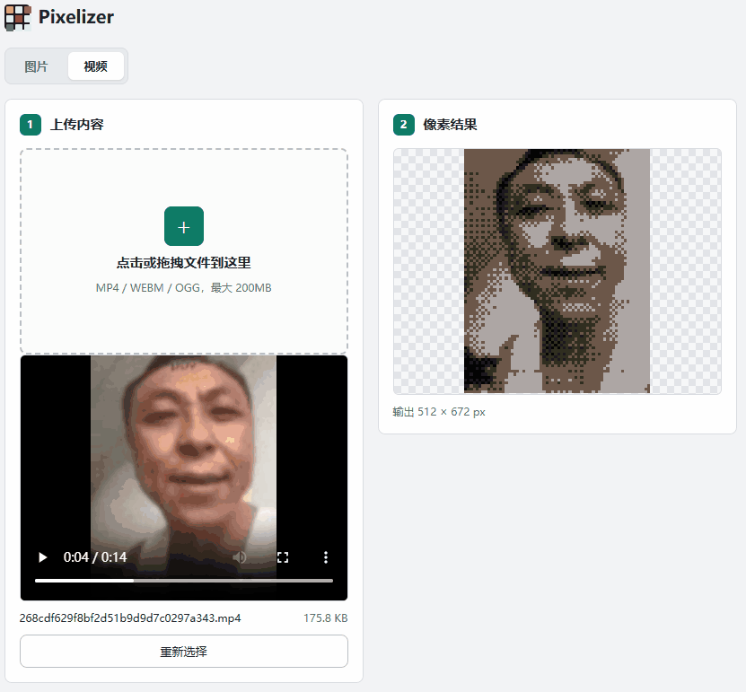

我做了一个像素画转换小工具 **Pixelizer**，上传图片或视频，就能一键转换成像素画风格，整个过程全部在浏览器本地完成，不需要上传到服务器，也不用安装任何东西。

这个工具参考了 [StoryCrafter Pixelizer](https://www.storycrafter.ai/pixelizer) 的像素化玩法，并做成了可以离线使用的网页版本。

## 图片转像素画

切换到「图片」模式，点击或拖入 JPG、PNG、WEBP 图片（最大 5MB），工具会自动提取图片主色调，并按当前参数生成像素画。右侧可以直接下载 PNG 结果。

## 视频转像素画

切换到「视频」模式，上传 MP4、WEBM、OGG 视频（最大 200MB），预览区会实时显示像素化后的画面。支持导出 WebM、MP4 视频，也可以把当前帧单独导出成 PNG。导出 MP4 时浏览器需要支持相关编码。

## 可调参数

- **像素粒度**：控制单个像素块的大小，范围 32 到 512
- **输出宽度**：控制最终图片或视频的宽度，范围 64 到 1024
- **抖动强度**：用抖动算法减少色带，让像素画更有质感
- **预模糊**：转换前先模糊一下原图，能柔化细节
- **自动对比度**：自动拉伸明暗范围，让结果更清晰

## 自定义调色板

工具内置一套默认调色板，也可以：

- 点击色块或输入十六进制色值修改颜色
- 从原图自动提取主色
- 添加最多 12 个自定义颜色
- 一键恢复默认调色板

## 下载源码

整个工具是纯 HTML、CSS、JavaScript 实现的静态页面，不依赖任何框架，也没有后端服务。我把完整源码打包好了：

[下载 pixelizer.zip](./pixelizer.zip)

下载后解压，双击 `index.html` 即可离线使用，也可以直接把整个文件夹部署到任意静态站点。
