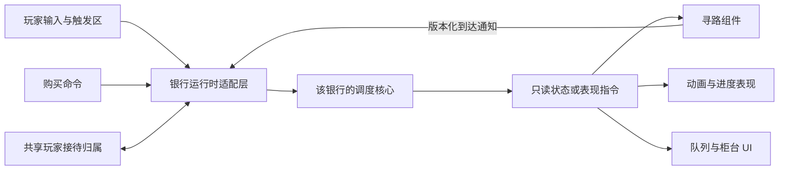
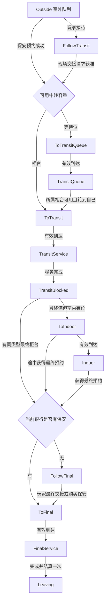

# 银行业务模拟经营：多银行顾客调度与逻辑改造说明

版本：1.0  
日期：2026-09-19  
用途：交给公司开发人员或 AI，参考本文修改现有 Unity 项目的顾客行为逻辑。  
基线：已实现的三银行 Demo，以及“玩家等待交接时，空位被保安分给门外顾客”的修复版本。

本文可以单独携带使用，不依赖聊天记录、截图或 Demo 工程。文中的类名是职责示例，不要求公司项目照搬命名、目录或框架。伪代码表达的是处理顺序与约束，不是可以直接粘贴编译的完整源码。

---

## 1. 给实施 AI 的任务说明

请先阅读公司项目现有代码，找出顾客、队列、柜台、玩家接待、保安、购买解锁、寻路回调与对象池之间的调用关系，再进行改造。

改造目标：

1. 支持三家独立银行：A+B、A+A、B+B。
2. 每家银行独立维护顾客、室外队列、中转等待队列、室内等待区、柜台预约、保安和柜台解锁。
3. 一个共享玩家可以移动到不同银行，但不能把顾客带到其他银行。
4. 没有保安时，保留玩家带领顾客办理中转与最终业务的流程。
5. 购买保安后允许自动接待，同时保留玩家手动带客能力。
6. 解决玩家与保安争抢同一顾客、同一空位，以及异步回调推进过期状态的问题。
7. 业务状态与寻路、动画、输入、UI 解耦，避免多个组件共同改写顾客状态。

实施要求：

- 保留现有项目可用的寻路、动画、交互和配置系统，通过适配层接入调度。
- 不要为三家银行复制三份业务脚本；使用同一套逻辑和三份独立配置、运行状态。
- 不要仅调整 Unity 脚本执行顺序、添加延时或增加布尔锁来修复竞争问题。
- 先补充能复现问题的测试，再修改调度入口，并验证手动、自动和混合模式。
- 对本文中标为“Demo 选择”的规则，与公司现有策划核对；不要把演示数值直接覆盖正式配置。
- 对标为“公司项目需补强”的内容，按现有项目是否涉及该场景实现，不要声称 Demo 已经包含这些能力。

交付时说明：修改了哪些状态与入口、如何保证预约与归属、哪些测试通过、哪些正式项目能力仍未覆盖。

## 2. 玩法与银行配置

### 2.1 顾客基本流程

```text
生成 -> 寻路到室外队列 -> 等待接待
     -> 玩家带领，或保安自动放行
     -> 中转柜台 / 该柜台的中转等待队列
     -> 中转业务：到达后播放动画并计时
     -> 最终柜台 / 室内等待区 / 留在中转柜台阻塞
     -> 最终业务：到达后播放动画并计时
     -> 结算一次 -> 自行离场
```

A 顾客只办理 A 中转与 A 最终业务；B 顾客只办理 B 中转与 B 最终业务。业务类型在顾客生成时确定，整个流程中不改变。

### 2.2 三家银行

| 银行 | 支持顾客类型 | 两个中转柜台 | 初始最终柜台组 | 第二组购买后新增 |
| --- | --- | --- | --- | --- |
| Bank-AB | A、B | 一个 A、一个 B | 一个 A、一个 B | 一个 A、一个 B |
| Bank-AA | 仅 A | A1、A2，均办理 A | 两个 A | 两个 A |
| Bank-BB | 仅 B | B1、B2，均办理 B | 两个 B | 两个 B |

两个中转柜台始终初始解锁。最终柜台只有第一组初始解锁，其他组通过购买开放。

上表对“每组两个最终柜台”的解释是当前 Demo 的配置选择。若公司策划定义不同，调整组内资源配置即可，不改变本文的调度原则。

### 2.3 必须区分业务类型和柜台身份

```text
BusinessType = A 或 B：决定可以办理什么业务。
TransitLaneId / DeskId：标识具体哪一个中转柜台及其等待队列。
BankId：标识资源属于哪一家银行。
```

Bank-AA 的两个柜台都属于 A 类型，但不是同一个柜台。不能使用 `Dictionary<BusinessType, 单个柜台>`，也不能通过 `(int)BusinessType` 直接当作场景柜台索引。

推荐查询方式：

```text
同银行 + 同业务类型 -> 多个候选柜台
具体 TransitLaneId -> 该柜台自己的等待队列
具体 SlotId -> 一个可预约站位
```

### 2.4 Demo 默认值

| 参数 | 当前值 | 说明 |
| --- | --- | --- |
| 中转业务时间 | 5 秒 | 到达柜台后开始 |
| 最终业务时间 | 30 秒 | 到达柜台后开始 |
| 生成间隔 | 2 秒 | 每家银行独立推进 |
| 室外容量 | 8 人 | 满员时暂停生成 |
| 每个中转柜台等待位 | 2 个 | 两个柜台分别维护 |
| 每家银行室内等待位 | 4 个 | 本银行 A/B 可共用 |
| 初始资金 | 300 | Demo 中各银行独立 |
| 保安价格 | 120 | 只开启本银行自动接待 |
| 第二组最终柜台价格 | 180 | 只解锁本银行资源 |
| 每位顾客最终结算收入 | 25 | 一位顾客只结算一次 |

这些数值用于观察拥堵，不是正式项目的硬编码要求。若正式游戏采用玩家全局钱包，应通过经济系统接口付款；银行的保安、队列和柜台状态仍必须独立。

## 3. 三类身份与职责

顾客同时涉及三种不同概念，不能用一个“正在跟随”布尔值代替：

| 概念 | 含义 | 生命周期 |
| --- | --- | --- |
| 所属银行 | 顾客属于哪一家银行 | 生成后固定，直到离场 |
| 玩家接待归属 | 玩家当前负责哪位顾客 | 接待时建立，按模式在交接时释放 |
| 位置预约 | 哪个柜台或等待位预留给该顾客 | 随业务流转进行原子迁移 |

“玩家负责该顾客”不等于“该顾客现在正在跟随”。例如无保安时，顾客在中转柜台办理业务期间不移动，但玩家仍负责后续带领。

保安是自动接待策略的开关或请求来源，不应成为可以任意改变顾客状态的第二个控制器。

## 4. 模块边界与解耦

### 4.1 推荐职责

| 模块 | 负责 | 不负责 |
| --- | --- | --- |
| BankConfig | 柜台配置、类型、容量、服务时间、解锁组 | 运行时抢占资源 |
| BankModel / BankScheduler | 顾客状态、预约、队列、优先级、业务计时 | Transform、动画、输入 |
| PlayerSession | 共享玩家的接待归属和银行切换资格 | 跨银行共用顾客池 |
| BankRuntimeAdapter | 将场景引用、输入、回调转换为核心命令，按固定顺序推进 | 另写一套业务决策 |
| CustomerNavigationView | 执行目标寻路、跟随、回报带版本的到达结果 | 直接更改业务状态 |
| CustomerAnimationView | 根据状态播放动画和表现进度 | 因动画结束而自行释放柜台 |
| ServicePointView / QueueView | 显示站位、占用、锁定、进度 | 根据“看上去没人”判断可用 |
| PurchaseAdapter | 付款与购买命令 | 修改另一家银行的状态 |
| WorldController | 共享玩家、世界时钟、银行定位、逐银行更新 | 将所有银行合并成一个业务队列 |

这些职责可以映射到公司现有模块，不要求拆成完全相同数量的类。关键是明确谁可以写入状态。

### 4.2 单一写入者

只有所属银行的调度核心可以修改：

- 顾客业务状态。
- 资源预约所有者。
- 队列逻辑成员与顺序。
- 服务开始和完成状态。

玩家触发器、保安脚本、动画事件和寻路组件提交请求或结果，由调度核心验证后执行。不要在 `OnTriggerEnter`、`Update`、协程结束和动画事件中分别写同一份业务状态。

Unity 主线程并不意味着不存在竞争。多个组件在同一帧按不同顺序执行，也会造成“前面检查失败，后面资源刚释放又被别人拿走”的时序问题。

### 4.3 数据依赖方向



核心最好可以在不启动场景的情况下运行测试。当前 Demo 的核心程序集禁止引用 UnityEngine。

## 5. 建议的数据模型

### 5.1 身份标识

```csharp
// 结构示意，类型可按公司现有 ID 系统调整。
CustomerKey = (BankId, CustomerId)
ResourceKey = (BankId, SlotId)
ArrivalTicket = (BankId, CustomerId, Revision)
```

两家银行同时存在 `CustomerId = 1` 是合法的，但不能将 Bank-AA 的 #1 到达通知应用到 Bank-AB 的 #1。

正式项目如果使用对象池或重用 ID，建议扩展：

```text
ArrivalTicket = (WorldSessionId, BankId, CustomerId, SpawnGeneration, Revision)
```

`SpawnGeneration` 用于区分同一池对象的不同生命周期；`WorldSessionId` 用于区分重开场景或读档前后的任务。当前 Demo 不重用顾客 ID，也未实现这两个扩展字段。

### 5.2 顾客

| 字段 | 用途 |
| --- | --- |
| BankId | 固定所属银行 |
| CustomerId | 银行内顾客身份 |
| BusinessType | 固定为 A 或 B |
| State | 当前业务状态 |
| SlotId | 当前逻辑预约的柜台或等待位，可为空 |
| Revision | 状态/目标版本，用于拒绝旧回调 |
| Arrived | 是否已经到达当前有效目标 |
| RemainingServiceTime | 当前服务剩余时间 |
| TransitCompletedOrder | 完成中转的先后序号，决定最终业务等待优先级 |
| QueueSequence | 正式项目建议增加：进入当前中转等待队列的顺序号 |

### 5.3 柜台与等待位

| 字段 | 用途 |
| --- | --- |
| BankId | 资源所属银行 |
| SlotId | 资源身份 |
| Kind | Transit、TransitQueue、Indoor、Final |
| BusinessType | 支持类型；室内等待位可以不指定业务类型 |
| TransitLaneId | 中转柜台及其等待队列的关联身份 |
| UnlockGroupId | 最终柜台所属购买组 |
| Unlocked | 是否已解锁 |
| OwnerCustomerKey | 当前预约所有者，无人时为空 |
| Occupied | 所有者是否已物理到达 |

空位判断必须是：

```text
Available = Unlocked && OwnerCustomerKey 为空
```

不能使用 `Occupied == false` 判断空位，因为正在走向柜台的顾客已经预约了它。

### 5.4 银行运行状态

每个 BankModel 独立持有：顾客集合、室外队列、资源集合、保安状态、解锁状态、服务计时、完成序号、事件记录，以及本银行玩家负责顾客的引用。

共享 PlayerSession 持有当前银行身份，并保证所有银行加起来最多存在一位玩家负责的顾客。不要在每家银行各自设置“玩家最多带一人”，却漏掉全局约束。

## 6. 顾客状态机

### 6.1 状态定义

| 状态 | 中文含义 | 位置预约 | 主要行为 |
| --- | --- | --- | --- |
| Outside | 室外排队，包括正在走向队列位置 | 由室外队列管理 | 到达后等待接待 |
| FollowTransit | 跟随玩家去中转 | 无中转预约 | 跟随玩家；交接失败时保持此状态 |
| ToTransit | 前往中转服务位 | 已预约中转柜台 | 寻路，到达后才开始服务 |
| ToTransitQueue | 前往中转等待位 | 已预约具体等待位 | 寻路到该柜台的等待队列 |
| TransitQueue | 中转等待 | 继续占用等待位 | 等自己所属柜台空出 |
| TransitService | 正在办理中转 | 占用中转柜台 | 动画与固定时长计时 |
| TransitBlocked | 中转已完成，下游暂无空间 | 仍占用中转柜台 | 不再服务、不再计时，等待迁移 |
| ToIndoor | 前往室内等待位 | 已预约室内等待位 | 可在途中改派到最终业务 |
| Indoor | 室内等待 | 占用室内等待位 | 等本业务最终柜台 |
| FollowFinal | 无保安时跟随玩家去最终业务 | 已预约同业务最终柜台 | 跟随，等待玩家最终交接 |
| ToFinal | 前往最终柜台 | 已预约最终柜台 | 寻路，到达后才开始服务 |
| FinalService | 正在办理最终业务 | 占用最终柜台 | 动画与固定时长计时 |
| Leaving | 业务完成，正在离场 | 无业务资源预约 | 自行走向本银行出口，随后回收 |

终止/取消可以通过统一清理命令实现，不要求一定增加独立枚举状态。

### 6.2 主要转移



图中没有画出的失败分支均保持当前合法状态。例如下游都满时，`TransitBlocked` 留在原柜台；中转容量都满时，`FollowTransit` 继续跟随。

## 7. 室外队列与接待归属

### 7.1 生成和排队

1. 生成器只生成本银行支持的业务类型。
2. 生成时确定 BankId、CustomerId 和 BusinessType。
3. 将顾客加入本银行室外队列尾部，分配目标位置。
4. 顾客实际到达有效目标后，才标记 `Arrived = true`。
5. 室外队列满员时 Demo 暂停生成，避免无限累积游戏对象。

排在队首但尚未走到队首位置的顾客不能被接待。逻辑排第一和物理已到达是两项检查。

### 7.2 玩家接待

必须同时满足：

- 玩家实际位于该银行接待区。
- PlayerSession 当前银行与该银行一致。
- 全世界没有另一位玩家负责的顾客。
- 室外队列非空，且队首已经到达。

成功后，在一个逻辑事务内完成：

```text
从室外队列移除队首
建立玩家 -> 顾客的接待归属
顾客状态切换为 FollowTransit
重排剩余室外顾客的位置
对目标位置改变的顾客增加 Revision，并清除 Arrived
```

玩家接待时不强制要求中转已有空位，因此可能带着顾客等候交接。保安不能接管或抢走这位已被玩家接待的顾客。

### 7.3 保安接待

保安只处理尚在本银行室外队列里的队首顾客，而且必须先找到并预约本银行的中转柜台或中转等待位。

预约成功才允许顾客离开室外队列；预约失败则仍在原队列。

当前 Demo 采用严格室外 FIFO：如果队首 A 暂时进不去，即使 B 有空位，也不越过 A 接待后面的 B。这是与“已入场的 A/B 业务并行”不同的规则。公司若要分业务室外排队，需要显式改变队列策略。

## 8. 中转交接与专属等待队列

### 8.1 交接区检测只提交请求

当玩家站在对应业务的中转交接区时，每个调度步提交：

```csharp
RequestTransitHandoff(BusinessType business);
```

这个函数只记录本次调度有效的交接意图，不立即决定资源归属。

提交前检查：玩家当前有负责的顾客、顾客处于 `FollowTransit`、业务匹配、银行匹配。请求中记录顾客身份及当前 Revision。

### 8.2 同类型柜台共享“接收候选池”

对 Bank-AA：玩家进入任一 A 交接区，候选资源是本银行所有 A 中转柜台和它们的等待位，而不是只检查触发区旁的那一张柜台。

对 Bank-AB：A 交接只查询 A，B 交接只查询 B。

对不同银行：即使都是 A，也绝不互相借用空位。

### 8.3 寻找接收资源

```text
候选柜台 = 当前银行中业务类型匹配的中转柜台

优先选择：
    空闲柜台，且该柜台没有已有等待顾客

否则选择：
    候选柜台中有可用等待位的队列
    优先选择已经预约的等待人数较少的队列
    并列时使用稳定的柜台顺序

两者均没有：
    不交接，顾客继续 FollowTransit
```

已经预约、尚未到达的等待顾客也算该队列的成员。不能因为队首还在走路，就让新来的顾客直接占用这个柜台。

### 8.4 等待位绑定具体柜台

候选池共享不代表队列混在一起。顾客成功获得某个柜台的等待位后，即加入该柜台的专属队列。

补位要求：柜台空闲、该队列存在队首、队首已经到达等待位。更后面的顾客即使先到，也不能越过尚在路上的队首。

Bank-AA 的 A1 等待队列默认只补到 A1，A2 等待队列只补到 A2。若公司希望两队动态互相转移，那是额外的队列重平衡功能，不能让普通空位搜索隐式完成。

### 8.5 正式项目的队列序号

正式接入时，建议在成功预约中转等待位时分配单调递增的 `QueueSequence`，按它决定队首。

当前 Demo 用顾客 ID 对已有中转等待顾客排序，这是简化实现。玩家可能早接待一个低 ID 顾客，却很晚才把他送到中转区；此时“生成先后”不等于“进入中转队列先后”。公司版本若要求严格按入队顺序 FIFO，必须使用实际入队序号，并补充该场景测试。不要把顾客 ID 排序直接当作所有情况下都正确的队列实现。

物理等待位是否需要逐格前移属于表现选择；队列逻辑顺序不应依赖顾客当前 Transform 或站位编号。

## 9. 服务开始、结束与下游拥堵

### 9.1 到达后才开始服务

预约柜台不等于开始办理。

```text
ToTransit + 有效到达 -> TransitService，初始化中转计时
ToFinal + 有效到达 -> FinalService，初始化最终计时
```

走路时间不应算入办理时间。动画根据服务状态播放，服务剩余时间由核心推进。

### 9.2 中转完成不等于柜台释放

中转服务计时结束时：

1. 剩余时间归零，状态改为 `TransitBlocked`。
2. 分配 `TransitCompletedOrder`。
3. 暂时继续持有中转柜台。
4. 在下游调度阶段尝试迁移。

即使马上能去最终柜台，也可以先经过这个短暂逻辑状态。只有目的地预约成功、迁移提交后，中转柜台才释放。

### 9.3 下游选择顺序

对 `TransitBlocked`、`Indoor`、`ToIndoor` 顾客，按完成中转的先后处理：

```text
有本银行同类型最终柜台：
    先预约最终柜台
    再释放当前资源
    有保安 -> ToFinal
    无保安 -> FollowFinal

没有最终柜台，且当前仍停在中转柜台：
    有室内等待位 -> 先预约室内位，再释放中转，进入 ToIndoor
    没有室内等待位 -> 保持 TransitBlocked，继续占着中转柜台

已经在室内等待或前往室内途中，且最终柜台仍不可用：
    保持当前安排
```

室内等待位可以是银行内 A/B 共用的空间，但最终业务始终按业务类型过滤。遍历到一个无法前进的 A 顾客时，应继续尝试后面的 B 顾客，不能因此停止整个银行的下游调度。

### 9.4 室内途中改派

`ToIndoor` 顾客已经占用了一个室内预约。如果同类型最终柜台在其途中空出，可以直接改派：

```text
预约最终柜台 -> 释放室内位 -> 更改目标和状态 -> Revision 增加
```

旧的“到达室内等待位”回调即使随后发生，也必须因版本过期而被拒绝。

### 9.5 无保安时的最终预约

当前 Demo 中，无保安顾客恢复跟随玩家前，先预约最终柜台，再进入 `FollowFinal`。

这样可以保证玩家带领途中不会失去已经分配的最终位置。代价是玩家不去交接时，该最终柜台会保持预约状态。这是当前规则的明确取舍，不应被 UI 当作空闲柜台。

### 9.6 最终完成与离场

最终计时结束后，释放最终柜台、结算一次、切换为 `Leaving`。顾客走到本银行出口后回收。

之后再次 Tick、重复动画回调或重复到达通知，都不能再次产生收入。公司正式项目若使用外部经济系统，应使用顾客完成事件 ID 实现幂等结算。

## 10. 每个调度步的严格顺序

这部分是修复竞争问题的核心，不应被拆散到多个脚本随意执行。

### 10.1 输入与准备阶段

1. 处理本银行的有效购买命令。
2. 验证并应用寻路到达结果。
3. 更新玩家实际所在银行及交互资格。
4. 若玩家在接待区，先尝试接待室外队首。
5. 采集玩家中转交接意图，记录本次调度的身份与版本。
6. 处理玩家最终交接；此时目标最终柜台已经预约。

### 10.2 核心推进阶段

```text
阶段 A：推进服务计时，处理本次完成的中转和最终业务
阶段 B：向最终柜台分配已完成中转的顾客；必要时分配室内等待位
阶段 C：已有中转等待队列向所属空闲中转柜台补位
阶段 D：处理本次玩家中转交接请求
阶段 E：保安处理室外队首的自动入场
```

这样，阶段 A/B 刚释放的资源，会先被阶段 C/D 看到，再由阶段 E 使用剩余容量。

### 10.3 生成与表现阶段

核心推进后再执行到期生成、回收已离场视图、下发最新寻路目标、同步动画和 UI、检查数据不变量。

Demo 每个调度步最多让保安接待一位室外顾客。正式项目可以扩展成循环填充，但整个循环仍必须位于玩家交接处理之后，并保持队首到达与 FIFO 检查。

### 10.4 世界层规则

每个银行每个逻辑步只推进一次。世界层更新全部银行，只有实际位于玩家脚下、且与 PlayerSession 一致的银行接收玩家交互。

离开银行只改变输入目标和视图焦点，不能停止、重建或清空原银行模型。

暂停与时间倍率由一个世界时钟管理。不要让三家银行分别写 `Time.timeScale`，也不要同时由世界和银行自己的 `Update` 重复 Tick。

## 11. 已发生的补位 Bug 与修复原理

### 11.1 观察到的现象

在 A-only 银行购买保安后，玩家带着 7 号顾客站在中转交接区。中转拥堵时，7 号一直跟随；出现空位后，较晚到达的门外 8、9 号却先进入了中转等待位。

### 11.2 错误顺序

| 同一帧内顺序 | 操作 | 结果 |
| --- | --- | --- |
| 1 | 玩家直接尝试分配中转位置 | 此刻仍满员，交接失败 |
| 2 | 业务计时结束，顾客迁移 | 柜台或等待位刚刚释放 |
| 3 | 保安自动入场 | 保安占用新空位 |
| 下一帧 | 玩家再次尝试 | 位置又满了，可能反复失败 |

这里即使“玩家脚本比保安脚本先执行”，也没有真正保证玩家优先。玩家检查发生在资源释放之前，保安检查发生在资源释放之后。

旧实现还将玩家交接固定在触发区对应的单个柜台。A-only/B-only 银行另一张同类型柜台空出来时，玩家无法使用它，保安却能全局搜索到它。

### 11.3 正确修复

将玩家“立即交接”改为“提交本次交接意图”，由同一个调度过程在资源释放和已有队列补位后处理，再运行保安入场。

优先级必须理解为：

```text
已有中转等待顾客 > 在交接区的玩家顾客 > 室外队首自动入场
```

玩家优先于门外新入场者，但不能插队抢已有等待顾客的柜台。如果旧队首补位释放的是等待位，玩家顾客可以先获得这个等待位，而不是必须直接获得柜台。

同类型交接搜索范围是“当前银行 + 匹配业务类型的所有中转接收资源”，不是全地图，也不是固定一个柜台。

### 11.4 请求不能永久保留

每次请求记录当前顾客及版本，处理后无论成功失败都清除。玩家仍在交接区时，下个调度步重新提交。

这样可以避免：

- 玩家已离开中转区，顾客却突然脱离跟随去办理。
- 旧顾客已取消，遗留请求被套用到新接待顾客。
- 购买保安或其他转移改变状态后，旧请求仍然生效。

## 12. 核心伪代码

### 12.1 交接请求

```csharp
bool RequestTransitHandoff(BusinessType business)
{
    Customer c = GetPlayerCustomerOfThisBank();
    if (c == null || c.State != FollowTransit) return false;
    if (c.BusinessType != business || c.BankId != this.BankId) return false;

    handoffThisStep = new Ticket(c.BankId, c.Id, c.Revision);
    return true; // 仅代表请求有效，不代表已经交接成功。
}
```

物理位置校验由运行时适配层完成；核心并不知道 Transform。若命令来自网络或可延迟消息，应再附加有效调度步号，拒绝跨步过期请求。

### 12.2 核心调度

```csharp
void Advance(float delta)
{
    ValidateDelta(delta);

    AdvanceServices(delta);
    // 最终完成：释放位置、结算一次、进入 Leaving。
    // 中转完成：进入 TransitBlocked，暂不无条件释放柜台。

    foreach (Customer c in ReadyForFinalOrderedByTransitCompletion())
    {
        Slot final = FindAvailableFinal(this.BankId, c.BusinessType);
        if (final != null)
        {
            TransferReservation(c, final,
                GuardPurchased ? ToFinal : FollowFinal);
        }
        else if (c.State == TransitBlocked)
        {
            Slot indoor = FindAvailableIndoor(this.BankId);
            if (indoor != null)
                TransferReservation(c, indoor, ToIndoor);
        }
    }

    foreach (Desk desk in AvailableTransitDesks())
    {
        Customer head = GetQueueHeadIncludingEnRoute(desk.TransitLaneId);
        if (head != null && head.State == TransitQueue)
            TransferReservation(head, desk.ServiceSlot, ToTransit);
    }

    Ticket? request = handoffThisStep;
    handoffThisStep = null;
    if (IsCurrentPlayerHandoff(request))
    {
        Customer c = GetCustomer(request.CustomerKey);
        Slot target = FindTransitAdmission(this.BankId, c.BusinessType);
        if (target != null)
        {
            TransferReservation(c, target,
                target.Kind == Transit ? ToTransit : ToTransitQueue);
            if (GuardPurchased) ReleasePlayerClaim(c);
        }
    }

    if (GuardPurchased)
    {
        Customer head = GetOutsideHead();
        if (head != null && head.Arrived)
        {
            Slot target = FindTransitAdmission(this.BankId, head.BusinessType);
            if (target != null)
                CommitOutsideAdmissionAndReservation(head, target);
        }
    }

    AssertInvariants();
}
```

下游等待集合包含 `TransitBlocked`、`Indoor` 和 `ToIndoor`。不要把尚未完成中转的顾客放进该集合。

### 12.3 预约迁移

```csharp
bool TransferReservation(Customer c, Slot target, State nextState)
{
    // 以下步骤由同一写入者同步提交，中间不能 await 或发布可重入事件。
    if (!ValidateBankAndBusiness(c, target)) return false;
    if (!target.Unlocked || target.Owner != null) return false;
    if (!ValidateCurrentSourceOwnership(c)) return false;

    Slot source = GetCurrentSlot(c);
    target.Owner = c.Key;
    target.Occupied = false;

    if (source != null)
    {
        source.Owner = null;
        source.Occupied = false;
    }

    c.SlotId = target.Id;
    c.State = nextState;
    c.Arrived = false;
    c.Revision++;
    return true;
}
```

外部表现事件应在提交完成后发布。正式实现如果提交过程可能抛异常，需要确保回滚不会遗留“两处预约”或“预约所有者与顾客记录不一致”。

### 12.4 到达通知

```csharp
bool OnArrived(ArrivalTicket ticket)
{
    if (ticket.BankId != this.BankId) return false;
    Customer c = GetCustomer(ticket.CustomerId);
    if (c == null || c.Revision != ticket.Revision || c.Arrived) return false;
    if (!IsArrivalDrivenState(c.State)) return false;
    if (!CurrentReservationStillBelongsTo(c)) return false;

    switch (c.State)
    {
        case Outside:        MarkOutsidePositionArrived(c); break;
        case ToTransit:      StartTransitService(c); break;
        case ToTransitQueue: EnterTransitQueue(c); break;
        case ToIndoor:       EnterIndoorWaiting(c); break;
        case ToFinal:        StartFinalService(c); break;
        case Leaving:        RemoveCompletedCustomer(c); break;
    }
    return true;
}
```

对于 `Outside` 和 `Leaving`，预约校验应按其各自规则处理，它们没有业务 SlotId。`FollowTransit` 和 `FollowFinal` 不使用普通“跟随到达”事件推进业务。

## 13. 预约、物理占用与动画

### 13.1 预约早于移动

```text
错误：发现空柜台 -> 让顾客走过去 -> 到达后才登记占用
正确：验证并预约柜台 -> 提交状态 -> 下发移动 -> 到达后登记物理占用
```

柜台灯或 UI 可以区分：锁定、可用、已预约未到达、已到达。但 UI 只是读模型，不是资源可用性的权威来源。

### 13.2 逻辑释放时点

当前 Demo 在提交离开原位置的迁移时就释放原资源，由 NavMesh 避障处理人物交错。这不等于旧人物已经完全走出柜台空间。

如果正式美术场景要求“旧顾客身体完全离开后，新顾客才进入”，应增加物理离位门控，例如资源的 `Vacating` 状态或门口通行令牌。它与业务预约属于不同约束，不应通过延迟所有调度回调来替代。

这个离位门控是正式接入可选扩展，当前 Demo 未实现。扩展后需相应更新资源可用条件、预约不变量和测试，不能一边宣称顾客只有一个资源，一边静默保留两个长期业务预约。

### 13.3 动画不是调度权威

服务动画可以循环播放，进度由核心计时驱动。动画中断、切换模型或暂停表现，不应自动导致柜台释放或重复结算。

若公司玩法必须由动画关键帧完成业务，应将它转换为带业务版本的完成请求，由核心验证后执行，而不是直接在动画事件里修改队列。

## 14. 购买保安与柜台解锁

### 14.1 保安切换矩阵

| 购买时顾客状态 | 购买后处理 |
| --- | --- |
| Outside | 不立即抢走全部队列，后续由正常调度自动入场 |
| FollowTransit | 保留玩家接待归属，继续由玩家带到中转区 |
| ToTransit / ToTransitQueue / TransitQueue | 保留当前预约与目的地，后续自动流转，释放玩家接待归属 |
| TransitService | 不重启服务、不清零进度，完成后自动寻找最终业务 |
| TransitBlocked / ToIndoor / Indoor | 保留资源与完成顺序，后续由自动下游调度处理 |
| FollowFinal | 保留已有最终柜台预约，改为 ToFinal，增加版本并释放玩家归属 |
| ToFinal / FinalService / Leaving | 保持现有流程，不重复办理或结算 |

判断后续是否自动流转，应使用该顾客所属银行的当前保安状态，而不是使用“这个顾客最初是谁接待的”作为永久模式标记。

### 14.2 玩家归属释放时机

| 模式 | 接待后中转等待/办理期间 | 释放玩家归属 |
| --- | --- | --- |
| 无保安 | 玩家仍负责该顾客 | 玩家成功交接最终业务时 |
| 有保安 | 中转交接成功后不再由玩家负责 | 成功预约中转柜台或中转等待位时 |
| 带领途中购买保安 | 尚在 FollowTransit 的顾客仍归玩家 | 后续中转交接成功时 |

最终业务交接成功时释放归属，不必等顾客走到最终柜台或完成最终业务，前提是最终预约已经提交。

### 14.3 解锁事务

一次购买至少检查：银行身份正确、该组尚未解锁、余额足够。

扣款与解锁是一个幂等事务。成功后只将该银行该组的资源标记为可用，下一次正常调度即可分配；不要重建队列、重新生成顾客、重置已有计时或重新发放收入。

正式经济接口如果异步返回，使用购买请求 ID 防重复扣款，并在结果提交时再次检查购买状态。不要在付款尚未成功时提前开放资源。

## 15. 银行隔离与玩家跨区

### 15.1 模型隔离

每家银行实例化自己的运行状态，不共享静态队列、资源容器或保安开关。

共享配置资产可以只读复用，但不可将顾客列表、预约所有者、已解锁标志等可变运行数据写入所有银行共用的 ScriptableObject。

全局查找顾客、柜台或保安时必须带 BankId。避免用无范围的 `FindObjectsOfType` 搜索“第一个空闲 A 柜台”作为业务分配入口。

### 15.2 当前 Demo 的跨区策略

当前采用的策略比“顾客不能跨区”更严格：只要玩家仍对某位顾客负有带领责任，玩家就不能离开该银行。

- 无保安时，顾客中转等待、服务、室内等待期间，玩家归属仍存在，因此也不能跨行。
- 有保安时，中转交接成功后玩家就可以离开，顾客在原银行继续自动办理。
- 没有负责顾客时，玩家可以自由进入其他银行。

这是 Demo 的明确行为选择。若公司希望“顾客服务期间玩家可以去别家银行”，必须增加“本地等待玩家领取/恢复带领”的状态与归属规则；不能仅删除边界限制，否则服务结束后顾客会追着玩家跨银行移动。

### 15.3 多层限制

1. 交互入口：跨行按钮检查 PlayerSession。
2. 移动目标：WASD、点击寻路、自动驾驶都经过同一个目标过滤器。
3. 已有路径：接待前已经发出的跨区路径，在建立接待归属后也要取消或限制。
4. 顾客目标：跟随目标不能超出所属银行可行走范围。
5. 导航范围：顾客仅使用本银行 NavMesh 区域，玩家可使用公共通道。
6. 核心身份：即使视图被错误移动，也不能将顾客归属或资源迁到另一银行。

Demo 使用矩形边界、三个不同 NavMesh area mask 和玩家路径纠正。正式项目需要适配实际银行形状、门口和已有 NavMesh 区域配置，不能照抄演示坐标、区域编号或把一个包围盒当成任意形状的真实可行走边界。

## 16. 回调、取消与生命周期

### 16.1 版本规则

以下变化至少需要让旧目标失效：

- 室外队列补位改变目标位置。
- 从跟随改为前往柜台/等待位。
- 从等待位改派其他业务资源。
- 从前往室内改派最终业务。
- 购买保安使最终跟随改为自动前往。
- 顾客取消、销毁或对象池重新使用。

异步任务捕获的是启动时的 Ticket，不要在回调执行时读取“当前 Revision”填入旧结果，否则失去了版本校验意义。

### 16.2 到达判定

到达通知至少要求：寻路任务已完成计算、路径完整且有效、已接受当前目标、剩余距离小于阈值、顾客身份与版本一致、该状态允许到达转移。

不能仅用 `remainingDistance == 0`：没有路径、路径失败、尚未计算时也可能出现类似数值。

跟随目标会持续移动，但只有业务任务或语义目标改变时才需要新业务版本；不需要每一次调整跟随坐标都创建新业务状态。

### 16.3 取消统一清理

取消必须通过所属银行核心处理，至少清理：

```text
业务资源预约
室外或中转队列成员
玩家接待归属
当前有效交接请求（或确保其身份/版本失效）
服务计时与有效任务身份
表现层对象及其回调订阅
```

清理后，再来的旧到达或完成通知必须被忽略。重复取消应可安全处理。

不要仅 `Destroy(customer.gameObject)` 而保留模型中的柜台所有者。

### 16.4 寻路失败恢复：公司项目需补强

当前 Demo 会重试部分无效寻路，但没有完整的永久不可达处理、超时回退和动态障碍恢复策略。

正式项目建议让导航层上报带 Ticket 的失败结果，由核心决定有限重试、改派、退回安全等待位置或取消。重试期间保留原有合法预约；决定取消或改派时统一释放/迁移。不能悄悄释放柜台但让顾客状态仍认为自己持有它，也不能每帧无限重新发出同一个不可达目标。

### 16.5 读档和场景卸载：公司项目需补强

当前 Demo 退出 Play 即重置，不包含存档、离线收益或对象池复用。

正式项目如需持久化，应保存逻辑状态和稳定身份，加载后从合法状态重建预约，并验证双方引用；清除前一场景的异步回调。不要保存一个仍会引用旧 Transform 或旧实例 ID 的导航任务对象。

## 17. 数据不变量与日志

### 17.1 每次调度提交后应成立的条件

- 顾客所属 BankId 不变，且与管理它的模型一致。
- 所有预约资源属于该银行，业务类型与顾客匹配。
- 锁定资源没有顾客所有者。
- 已到达占用的资源一定存在有效预约所有者。
- 资源记录的顾客与顾客记录的 SlotId 双向一致。
- 在当前 Demo 的单资源设计中，一个顾客在迁移事务提交后最多持有一个业务资源。
- 室外队列成员唯一，数量不超过容量，成员状态为 Outside。
- 处于 FollowTransit 或 FollowFinal 的顾客，一定是玩家当前负责的顾客。
- 全部银行合计最多存在一个玩家负责顾客。
- 仍有玩家负责顾客时，PlayerSession 的当前银行与其所属银行一致。
- 进入最终服务的顾客已经完成中转。
- 每位顾客只结算一次；Leaving 顾客不再持有业务资源。
- 过期请求、过期到达通知不会改变任何资源所有者。

最后几项可通过状态转移约束、独立断言或测试保证，不必全部写成逐帧全量扫描。生产环境可以降低检查频率，但开发环境应能明确报出破坏了哪条约束。

### 17.2 建议的日志字段

```text
Tick / SimulationTime
BankId
CustomerId / Generation / Revision
CommandSource：Player / Security / Arrival / Timer / Purchase
OldState -> NewState
SourceSlot -> TargetSlot
Decision：Accepted / Rejected
Reason：WrongBank / WrongBusiness / NoCapacity / StaleRevision /
        PlayerAlreadyClaimed / QueueHeadNotArrived / ResourceLocked
```

排查“玩家一直不补位”时，需要看到请求是否到达、检查发生在释放前还是释放后、候选范围是否包含另一张同类柜台，而不只是看到“正在跟随”。

## 18. 已验证的自动化用例

以下是本地 Demo 最近一次运行通过的 28 项 EditMode 测试。它们验证核心逻辑，不代表公司项目、美术场景、对象池或正式经济接口已通过相同验证。

| 编号 | 场景 | 关键断言 |
| --- | --- | --- |
| 01 | 初始柜台与购买解锁 | 两个中转开放，仅第一组最终开放，重复购买不扣款 |
| 02 | 玩家与保安同帧接待 | 玩家先取得队首，保安不能抢走，玩家不重复接待 |
| 03 | FollowTransit 时购买保安 | 原顾客继续跟随；中转交接后自动流转 |
| 04 | 完整手动流程 | 两次玩家交接有效，到达才计时，完成只结算一次 |
| 05 | 顾客尚在前往柜台 | 柜台已预约，后来者不能再次占用 |
| 06 | 室内满员及最终扩容 | 中转保持阻塞，解锁后等待与补位恢复 |
| 07 | A 堵塞而 B 可用 | B 仍能办理，不跨业务分配 |
| 08 | 中转队首仍在路上 | 已到达的后续顾客不能越过队首 |
| 09 | 旧到达与取消 | 旧版本、重复通知和取消后的通知无效，资源释放 |
| 10 | FollowFinal 时购买保安 | 保留最终预约，改为自动前往，释放玩家归属 |
| 11 | 余额不足 | 不购买、不扣款、不改变解锁状态 |
| 12 | 16,000 步混合模拟 | 生成、取消、手动、保安、解锁后不变量成立并最终排空 |
| 13 | AA 双中转 | 两个不同柜台都能接收 A，拒绝生成 B |
| 14 | BB 双中转 | 两个不同柜台都能接收 B，拒绝生成 A |
| 15 | 跨银行相同本地 ID | 来自另一家银行的到达通知被拒绝 |
| 16 | 保安、钱、解锁与队列隔离 | 操作一家不会改变另外两家 |
| 17 | 玩家跨行接待 | 有负责顾客时不能跨行或再接待，交接后可进入下一家 |
| 18 | 双同类柜台专属等待队列 | 只给对应柜台补位 |
| 19 | 玩家不在的后台银行 | 已有保安的银行独立完成顾客流程 |
| 20 | AA 无等待位，柜台本帧空出 | 现场玩家顾客先于门外顾客获得柜台 |
| 21 | BB 无等待位，柜台本帧空出 | 同上，验证 B 类型 |
| 22 | AA 有等待位，旧队首本帧补位 | 玩家获得刚释放的等待位，门外顾客不抢占 |
| 23 | BB 有等待位，旧队首本帧补位 | 同上，验证 B 类型 |
| 24 | AA 另一张柜台可用 | 玩家交接可分配到另一张 A 柜台 |
| 25 | BB 另一张柜台可用 | 玩家交接可分配到另一张 B 柜台 |
| 26 | 玩家离开交接区 | 上一次未成功请求不会永久保留 |
| 27 | 请求后取消并接待新人 | 旧请求不能应用到新顾客 |
| 28 | 业务触发区不匹配 | 不提交交接、不错误分配资源 |

### 18.1 补位问题的最小复现步骤

```text
配置：AA 银行，两个中转柜台，各一个等待位，已购买保安。

1. C1 占用第一个中转柜台并开始服务，剩余 5 秒。
2. C2 已预约第二个中转柜台，但尚未到达，不会在本次结束服务。
3. C3、C4 分别进入两个中转等待位，均已到达。
4. 玩家接待 C5，并在 A 中转交接区提交请求。
5. C6 已到达室外队首，保安也希望让它入场。
6. 推进 5 秒，使 C1 本次完成并离开中转。

期望：
    C3 按原队列优先级进入第一个中转柜台。
    C5 获得 C3 刚释放的等待位。
    C6 仍在室外。
    玩家中转交接成功，接待归属释放。
```

将 AA 改成 BB 应得到相同结果。将中转等待容量改成 0，则本次空出的柜台应直接分给玩家顾客。

### 18.2 公司项目额外验收

以下是接入时应补充的场景，不是当前 28 项测试已经覆盖的能力：

- 早生成的手动顾客晚于其他顾客进入中转队列，按实际入队顺序排队。
- 玩家提交跨区路径后才接待顾客，旧路径不会带其越界。
- 同时收到解锁结果、服务完成和玩家交接请求，分配顺序仍正确。
- 玩家与顾客站在交接区边缘，连续进出不会重复交接。
- 重复触发器、多个 Collider、多次动画回调不会重复办理。
- 导航永久失败、动态障碍堵路、柜台移除时能够恢复或清理。
- 对象池复用相同对象/ID，上一轮生命周期的回调被拒绝。
- 保存再加载、场景卸载再进入，预约可重建且旧回调失效。
- 不同帧率、暂停恢复、加速运行下没有依赖固定延时的行为。
- 正式经济接口重试时，同一购买/结算不会重复扣款或发奖。
- 顾客在服务期间取消，不产生剩余预约、残留玩家归属或重复收入。

## 19. 公司项目的改造顺序

### 第一步：梳理现有写入点

搜索所有设置跟随目标、出队入队、占用柜台、释放柜台、启动服务协程、监听动画结束和购买保安的代码。画出谁调用谁，标记所有直接写业务状态的位置。

### 第二步：引入身份与配置

先补齐稳定 BankId、CustomerKey、SlotId、BusinessType、TransitLaneId 与 UnlockGroupId。检查是否存在“一个业务类型只对应一个柜台”的旧假设。

### 第三步：建立统一资源预约

把空位判断统一到资源模型；将“开始走路后才占位”改成“先预约再走路”。增加源/目标所有者一致性检查。

### 第四步：收敛业务状态写入

保留现有寻路与动画组件，通过适配层下发目标和上报结果。核心接管业务状态和服务时钟，旧组件停止直接改队列与柜台。

### 第五步：实现固定调度阶段

优先完成第 10、11、12 节的顺序改造。运行补位问题回归测试，确认新空位不会在玩家请求被处理前被保安拿走。

### 第六步：接入保安与购买事务

按购买切换矩阵迁移状态，保持已有任务进度与预约。保安只给当前银行开启自动策略。

### 第七步：接入共享玩家与三银行实例

全局限制玩家接待数量；所有银行继续推进；输入只投递给实际所在银行；顾客路径与归属都限制在自己的银行。

### 第八步：生命周期与验收

接入公司的对象池、存档、经济回调、动态场景逻辑；补全第 18.2 节适用用例。提供测试结果和关键场景日志，而不是仅以“画面看起来能走”作为完成标准。

## 20. 不应出现的实现方式

- 三家银行复制三套顾客脚本，后续分别修补逻辑。
- 用全局静态保安开关控制所有银行。
- 只存局部顾客 ID，却把事件发布到全局事件总线。
- 玩家、保安、柜台和动画都能直接调用任意状态切换。
- 玩家先尝试一次失败后，就在同一帧让保安抢走刚释放的资源。
- 把“玩家优先”解释成插到已经排队的中转顾客前面。
- AA 银行只检查某一个 A 柜台，另一张空柜台只对保安可用。
- 以是否有角色模型站在柜台旁判断资源是否空闲。
- 中转计时结束就无条件释放柜台，忽略下游满员。
- 通过 `WaitForSeconds`、多等一帧或调整 Script Execution Order 掩盖预约竞争。
- 玩家离开交接区后仍持有永久排队优先请求。
- 购买保安时清空或重置顾客、队列、计时与预约。
- 切换当前银行时销毁或重建其他银行业务状态。
- 在 UI 禁止跨行，却让键盘、鼠标寻路或旧路径绕过限制。
- 正式项目使用对象池，却只依赖每次从 1 开始的 Revision 区分生命周期。

## 21. Demo 源码对应关系

这部分仅供公司同时获得 Demo 时定位；即使没有这些文件，前文也足够指导实现。

| Demo 内相对路径 | 参考内容 |
| --- | --- |
| `Assets/BankDemo/Core/BankModel.cs` | 状态、资源、队列、服务推进、购买、RequestTransitHandoff 与分阶段处理 |
| `Assets/BankDemo/Core/BankPlayerSession.cs` | 共享玩家归属和跨银行接待限制 |
| `Assets/BankDemo/Runtime/BankDemoController.cs` | 交接区采样、每银行 Tick、生成与表现同步 |
| `Assets/BankDemo/Runtime/BankWorldController.cs` | 三银行更新、当前银行识别、共享玩家与导航范围 |
| `Assets/BankDemo/Runtime/BankActorView.cs` | 版本化导航结果和基础服务动画 |
| `Assets/BankDemo/Runtime/BankPlayerMotor.cs` | 所有玩家移动入口及已有路径限制 |
| `Assets/BankDemo/Tests/Editor/BankModelTests.cs` | 原始 12 项核心用例 |
| `Assets/BankDemo/Tests/Editor/BankIsolationTests.cs` | 7 项多银行用例 |
| `Assets/BankDemo/Tests/Editor/PlayerHandoffPriorityTests.cs` | 9 项交接优先级回归用例 |
| `Assets/BankDemo/ThreeBanks.unity` | 三银行演示场景 |

正式接入应保留的是身份隔离、状态转换约束、原子预约、版本校验和固定调度顺序；基础人物、演示坐标、英文 UI、相机布局和演示价格不属于需要迁移的业务逻辑。
